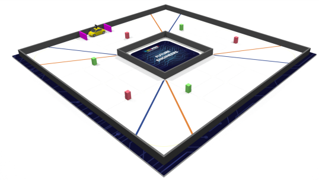
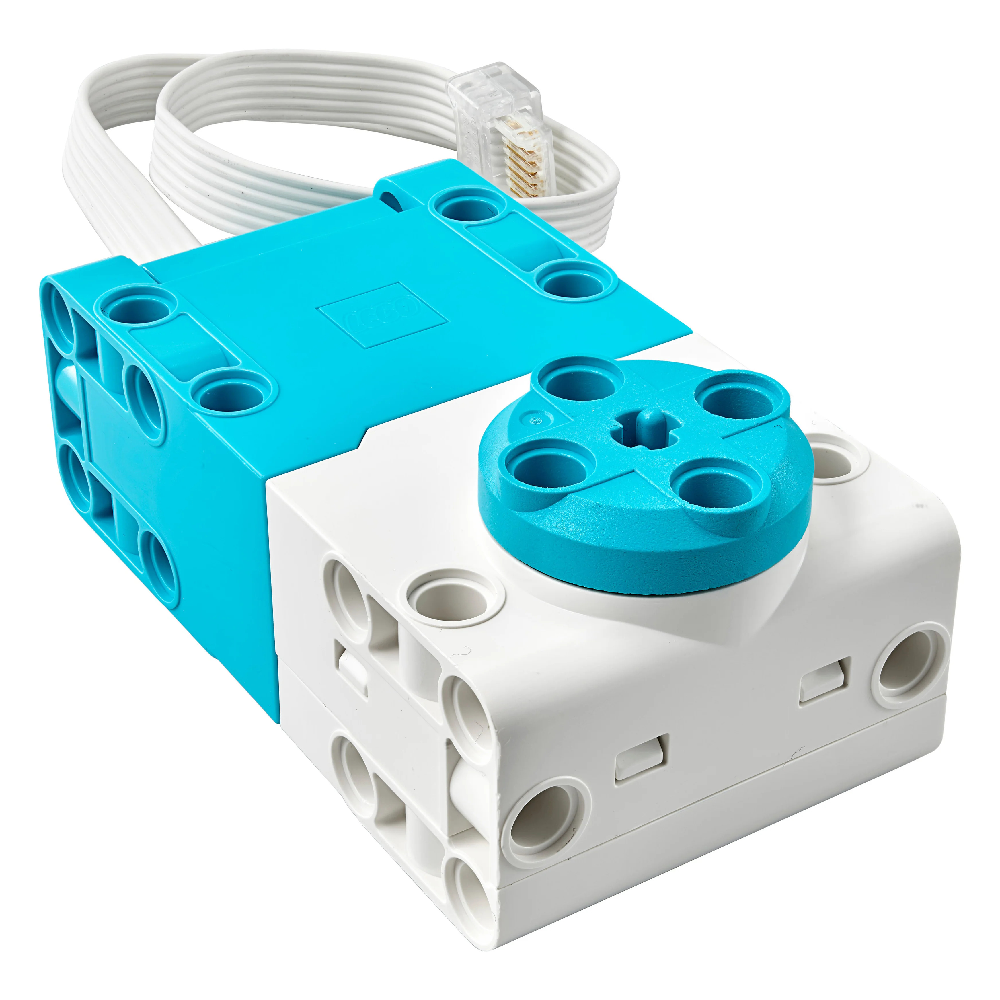
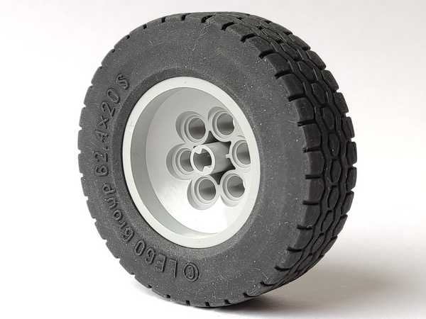
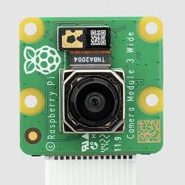
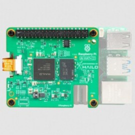

# CSS - WRO Future Engineers 2026

This repository contains the engineering documentation for **CSS**'s autonomous vehicle for the **WRO Future Engineers**, 2026 season. Our team is based in Querétaro, México.

---

## Table of Contents

1. [Our Team](#our-team)
2. [Challenge Overview](#challenge-overview)
3. [Our Robot](#our-robot)
   - [3.1 Mobility Management](#mobility-management)
   - [3.2 Power & Sense Management](#power-sense-management)
   - [3.3 Obstacle Management & Control Strategy](#obstacle-management)
4. [Engineering Process & Design Iterations](#engineering-process)
5. [Construction Guide](#construction-guide)
6. [Bill of Materials (BOM)](#bom)
7. [Repository Structure](#repository-structure)
8. [Setup & Execution Instructions](#setup-instructions)
9. [Driving Videos](#driving-videos)
10. [Resources & References](#resources)
11. [License](#license)

---

## 1. Our Team <a id="our-team"></a>
<br>
***Disclaimer:***
*This image has been edited to remove former team members who are no longer part of the project, in order to protect their privacy. Editing was done using Microsoft Photos' generative erase feature.*

### Team Members

#### Christian Gael Centeno Velez
**Age:** 17\
**Role:** Captain. Software, electronics and mechanical design\


>I am currently in my senior year of high school at the Colegio de Estudios Científicos y Tecnológicos del Estado de Querétaro (CECyTEQ), specializing as a Mechatronics Technician. I have a strong background in competitive robotics, having participated in previous editions of the World Robot Olympiad (WRO). In 2024, I competed in the RoboMission category, and in 2025, I secured third place at the national level in the Future Engineers category. Through my years of experience competing in the WRO, I have developed solid skills in robot programming, design, and electronics.

#### Sebastián Esquivel Mondragón
**Age:** 18\
**Role:** Documentation, electronics and mechanical design\


> Currently pursuing a Bachelor of Science in Mechatronics Engineering at Monterrey Institute of Technology and Higher Education (ITESM), on an academic talent scholarship. My background in robotics began in middle school with the MekLab Robotics team (UAQ), where I competed in WRO RoboMission, placing 3rd nationally in 2022 (Junior) and 2nd nationally in 2023 (Senior), qualifying for the international final in Panama. In 2025, our now independent and disaffiliated team moved into WRO Future Engineers, placing 2nd nationally. Most of my software and electronics experience comes from these competitions. I've also worked as an intern at GS de México (GS Global), in the Research and Development (R&D) department, where I further developed CAD design skills and many other engineering competencies, such as problem solving skills, now applied towards this project.

---

### Coach and other members

#### Manuel Alejandro Cardoso Duarte
**Age:** 27\
**Role:** Coach\

> Bachelor of Technology from the Universidad Nacional Autónoma de México (UNAM), Centro de Física Aplicada y Tecnología Avanzada (CFATA), and currently works as an Embedded Software Engineer at KOSTAL Automotive Services Mexicana, developing AUTOSAR-based embedded software (C, CAN/LIN bus communication, memory stack integration) for automotive door control modules serving clients such as Stellantis, FORD, and Rivian. His background in robotics coaching spans since February 2018, guiding high school teams at the Facultad de Ingeniería, Universidad Autónoma de Querétaro (UAQ) through the World Robot Olympiad, including leading our team to the 2023 international final in Panama City and to a national podium finish in RoboMission. As coach, his role is to teach the underlying engineering and programming concepts (Python, C, embedded systems) and guide the team's problem-solving process, without building or programming the vehicle himself.For more information visit: [CV Alejandro](other\CV_Manuel_Alejandro_Cardoso_Duarte_2026-compressed.pdf)

---

#### José de Jesús Santana Ramírez, M.Sc.
**Age:** 40\
**Role:** Assistant coach\


>Mechatronics Engineer and Master of Science in Instrumentation and Control, with a solid track record in teaching, technological development, and innovation-oriented engineering applications. Currently pursuing a Ph.D. in Computer Science, focusing on research areas related to artificial intelligence, neural networks, computational modeling of physical systems, and control of mechanical systems. His expertise integrates hardware and software development for robotics, automation, and embedded systems projects. He serves as the coordinator of the Center for Studies in Robotics and Sciences (CEROC) at UAQ, as well as a professor in the Space Engineering degree program at ENES-UNAM. His professional profile is distinguished by connecting academic training, applied research, and a commitment to the scientific and technological education of future generations.
---

#### Rocío Damara Merlo Espino, Ph.D.
**Age:** 36\
**Role:** Administrative project manager\


>Academic Degrees:
>- Bachelor’s Degree in Psychology, Educational concentration.
>- Specialization in School Learning.
>- Master’s Degree in Innovation in Virtual Teaching-Learning Environments.
>- Ph.D. in Educational Technology.
>
>Professional with a background in Psychology, School Learning, Innovation in Virtual Teaching-Learning Environments, and Educational Technology. She is the co-leader of the international chapter Women in Robotics Querétaro, Mexico, and brings over 12 years of experience in educational robotics, science pedagogy, and scientific outreach. Currently, she is completing a postdoctoral fellowship in Quality Management Systems for Engineering and Space Industry Laboratories at the High Technology Unit of the Faculty of Engineering at UNAM. In addition, she is a professor of Aerospace Engineering at ENES Juriquilla, a researcher, and Head of the Outreach Department at the Center for Studies in Robotics and Sciences (CEROC) at UAQ. She has driven academic, scientific, and technological projects, as well as student development in STEAM competencies.

---

## 2. Challenge Overview <a id="challenge-overview"></a>



The **WRO Future Engineers** challenge requires teams to build a fully autonomous vehicle capable of completing both of the following challenges:

### Open Challenge
The vehicle must complete three laps on the track with random placements of the inside track walls.

### Obstacle Challenge
The vehicle must complete three laps on the track while detecting and avoiding randomly placed coloured obstacles (either green or red blocks), passing them on a specific side according to their colour, and then finish by performing a parallel parking maneuver.

More info: [WRO Official Site](https://wro-association.org/) | [Future Engineers Rules](other/WRO-2026-Future-Engineers-Self-Driving-Cars-General-Rules.pdf)

---

## 3. Our Robot <a id="our-robot"></a>

**Robot name:** ***"The Maker"***


<table style="width:100%">

<tr>

<td align="center"><br>Top</td>

<td align="center"><br>Front</td>

<td align="center"><br>Left</td>

</tr>

<tr>

<td align="center"><br>Bottom</td>

<td align="center"><br>Back</td>

<td align="center"><br>Right</td>

</tr>

</table>

***"The Maker"*** is a rear-wheel-drive autonomous vehicle built around a fully custom, in-house 3D-printed chassis (designed in SolidWorks, printed on a Creality K1C) that repositions the battery pack and most components lower in the frame to lower the center of gravity and reduce weight transfer through corners. This year's chassis also trades the sharper-turning custom double-Ackermann steering geometry used in last year's prototype for a simpler regular-Ackermann, a deliberate trade-off made after trial and error showed the reliability gain outweighed the small loss in turning radius. A single LEGO SPIKE Large Angular Motor drives the rear axle while a LEGO SPIKE Small Angular Motor actuates the Ackermann steering, both commanded by a LEGO SPIKE Prime Hub, whose built-in IMU also supplies the robot's heading. Perception comes from a Orbbec Oradar MS200k LiDAR fused with a Raspberry Pi Camera Module 3 Wide accelerated by a Raspberry Pi AI HAT+ 2 (Hailo-10H, 40 TOPS). The LiDAR handles wall-following and obstacle range, the camera tracks the obstacles using a custom-trained YOLOv8n model (trained on our own labeled dataset and compiled to the Hailo-10H's `.hef` format) and classifies pillar colour, and this year's design drops the ultrasonic sensors, now using only the LiDAR and camera. All control and vision code runs in C/C++ on a Raspberry Pi 5, migrated from last year's Python codebase specifically to cut processing latency, and the whole robot is considerably lighter and more power-efficient than its predecessor: a smaller steering motor, a lighter AI/camera replacing an OAK-D Lite, and a 4-cell battery pack (down from 6 cells) sized to match the lower power draw.

### 3.1 Mobility Management <a id="mobility-management"></a>

#### Steering System

The Maker's steering uses a regular Ackermann linkage, achieving a maximum steering angle of **45.44°**. This geometry ensures the inner and outer front wheels trace concentric arcs around a common turning center during a turn, minimizing tire scrub and keeping the front tires rolling rather than dragging through corners, a property that matters directly for both consistency and tire wear over a full run.


*Figure 1. Plan view of the current Ackermann steering linkage, showing the tie-rod and knuckle geometry.*


*Figure 2. Detail view of the CAD model highlighting the achieved maximum steering angle of 45.44°.*

The Ackermann is actuated by a LEGO SPIKE Prime Small Angular Motor (Part 45607), commanded by the LEGO SPIKE Prime Hub. This is a change from previous seasons, where a medium angular motor was used: with this year's lighter chassis and reduced overall mass, the torque required to actuate the steering dropped enough that the smaller motor became sufficient, and switching to it freed up both weight and packaging space for other components.

This regular Ackermann design also represents a deliberate step back from last year's steering geometry. In the previous season, the team implemented a custom double-Ackermann linkage, which allowed for a tighter turning radius but introduced mechanical inconsistencies and reliability flaws during testing.


*Figure 3. Bottom view of the previous season's robot, showing the double-Ackermann steering configuration used last year.*

After weighing both options, the team concluded that the regular Ackermann's slightly wider turning radius was an acceptable trade-off given the reliability gained: it consistently completes every required turn on the WRO track, while eliminating the mechanical inconsistencies that affected the double-Ackermann design.


#### Drivetrain

This year's drivetrain also marks a layout change from last year's all-wheel-drive (AWD) configuration (see [Figure 3](other\additionalMedia\Others\Bottom2025.jpg)) to a rear-wheel-drive (RWD) layout. Driving only the rear axle simplified the drivetrain (removing the front differential/driveshaft hardware needed for AWD), reducing weight and mechanical complexity, while still providing enough traction for the WRO track once paired with the new LEGO 62.4×20S rubber tires.

The vehicle uses a single LEGO SPIKE Large Angular Motor (Part 45602) driving the rear axle through a $20{:}28$ gear reduction ($R = 1.4$), turning LEGO $62.4 \times 20\text{S}$ rubber tires (Part 32019) ($r = 0.0312\text{ m}$). The motor and gear ratio were not assumed, they were sized against a full dynamic torque analysis targeting $a = 0.73\text{ m/s}^2$ over $t = 0.5\text{ s}$ to reach cruising speed.
<table>
  <tr>
    <td align="center">
      <br>
      <em>LEGO SPIKE Large Angular Motor (45602)</em>
    </td>
    <td align="center">
      <br>
      <em>LEGO Tire 62.4 x 20 S (32019)</em>
    </td>
  </tr>
</table>

**Result:**
 at this operating point, the motor runs at only **33.8%** of its continuous max-efficiency torque capacity, reaching a loaded top speed of **0.365 m/s**, leaving a **66.2%** torque reserve for inclines or unexpected track perturbations.

> ### Full torque & speed calculations
>
> #### 1. Design Inputs & Parameters
>
> | Parameter | Symbol | Value | Unit |
> | :--- | :---: | :---: | :---: |
> | Robot Mass | $m$ | $1.006$ | $\text{kg}$ |
> | Wheel Diameter | $d$ | $0.0624$ | $\text{m}$ |
> | Wheel Radius | $r$ | $0.0312$ | $\text{m}$ |
> | Target Linear Acceleration ($t = 0.5\text{ s}$) | $a$ | $0.73$ | $\text{m/s}^2$ |
> | Rolling Resistance Coeff. (Rubber LEGO $62.4 \times 20\text{ S}$) | $C_{rr}$ | $0.03$ | -- |
> | Acceleration of Gravity | $g$ | $9.81$ | $\text{m/s}^2$ |
> | Number of Drive Motors | $N$ | $1$ | -- |
> | Gearbox Reduction Ratio ($20:28$) | $R$ | $1.4$ | -- |
> | Gearbox Efficiency | $\eta$ | $0.85$ | -- |
>
> **2. Step-by-Step Derivation**
>
> **Step 1: Linear Acceleration Force ($F_{acc}$)**
>
> $$
> F_{acc} = m \cdot a = 1.006\text{ kg} \cdot 0.73\text{ m/s}^2 = 0.7344\text{ N}
> $$
>
> **Step 2: Rolling Resistance Force ($F_{rr}$)**
>
> $$
> F_{rr} = C_{rr} \cdot m \cdot g = 0.03 \cdot 1.006\text{ kg} \cdot 9.81\text{ m/s}^2 = 0.2961\text{ N}
> $$
>
> **Step 3: Total Linear Force ($F_{total}$)**
>
> $$
> F_{total} = F_{acc} + F_{rr} = 0.7344\text{ N} + 0.2961\text{ N} = 1.0305\text{ N}
> $$
>
> **Step 4: Total Wheel Torque ($T_w$)**
>
> $$
> T_w = F_{total} \cdot r = 1.0305\text{ N} \cdot 0.0312\text{ m} = 0.03215\text{ N}\cdot\text{m}
> $$
>
> **Step 5: Nominal Motor Torque ($T_m$)**
>
> $$
> T_m = \frac{T_w}{\eta \cdot R} = \frac{0.03215\text{ N}\cdot\text{m}}{0.85 \cdot 1.4} = 0.02702\text{ N}\cdot\text{m} \quad (\approx 2.70\text{ Ncm})
> $$
>
> **Step 6: Motor Torque with Safety Factor ($T_{m,req}$)**
>
> A 25% safety margin ($1.25\times$) is applied to establish the minimum required torque of the traction motor, accounting for dynamic losses not captured above:
>
> $$
> T_{m,req} = T_m \cdot 1.25 = 0.02702\text{ N}\cdot\text{m} \cdot 1.25 = \mathbf{0.03377\text{ N}\cdot\text{m}} \quad (\approx 3.38\text{ Ncm})
> $$
>
> **3. LEGO SPIKE Large Angular Motor (45602) Analysis & Speed Derivation**
>
> **3.1 Motor Technical Specifications (9V)**
>
> | Operating Condition | Torque ($\text{N}\cdot\text{m}$) | Torque ($\text{Ncm}$) | Speed ($\text{RPM}$) | Current ($\text{mA}$) |
> | :--- | :---: | :---: | :---: | :---: |
> | No Load | 0.0000 | 0.00 | 175 ± 15% | 135 ± 15% |
> | Max Efficiency | 0.0800 | 8.00 | 135 ± 15% | 430 ± 15% |
> | Stall Limit | 0.2500 | 25.00 | 0 | 1900 ± 15% |
>
> **3.2 Motor Operating Point & Load Analysis**
>
> **Continuous Duty Load (%)** (vs. Max Efficiency Point):
>
> $$
> \text{Load}_{\text{eff}} = \frac{T_m}{T_{\text{max-eff}}} \cdot 100 = \frac{2.70\text{ Ncm}}{8.00\text{ Ncm}} \cdot 100 = \mathbf{33.8}\verb|%|
> $$
>
> **Stall Limit Margin (%)** (vs. Stall Torque):
>
> $$
> \text{Load}_{\text{stall}} = \frac{T_m}{T_{\text{stall}}} \cdot 100 = \frac{2.70\text{ Ncm}}{25.00\text{ Ncm}} \cdot 100 = \mathbf{10.8}\verb|%|
> $$
>
> **3.3 Top Speed Derivation**
>
> **Step 1: Loaded Motor RPM**
>
> $$
> \text{RPM}_{\text{motor}} = \text{RPM}_{\text{no-load}} \cdot \left(1 - \frac{T_m}{T_{\text{stall}}}\right) = 175 \cdot \left(1 - \frac{2.702\text{ Ncm}}{25.00\text{ Ncm}}\right) = 156.1\text{ RPM}
> $$
>
> **Step 2: Loaded Wheel RPM**
>
> $$
> \text{RPM}_{\text{wheel}} = \frac{\text{RPM}_{\text{motor}}}{R} = \frac{156.1\text{ RPM}}{1.4} = 111.5\text{ RPM}
> $$
>
> **Step 3: Top Loaded Linear Speed**
> $$v_{loaded} = \frac{\text{RPM}_{wheel} \cdot \pi \cdot d}{60} = \frac{111.5 \cdot \pi \cdot 0.0624}{60} = \mathbf{0.365\text{ m/s}}$$
>
> **3.4 Technical Conclusion**
>
> With $a = 0.73\text{ m/s}^2$, the robot reaches its operational cruising speed of $0.365\text{ m/s}$ in exactly $0.5\text{ s}$. Operating at only 33.8% of the motor's continuous max-efficiency capacity ensures minimal thermal build-up and low current draw, leaving a 66.2% torque reserve to absorb unexpected track perturbations.

#### Chassis Design

The chassis is a fully custom, in-house design, modeled in SolidWorks and 3D-printed on a Creality K1C. This is a continuation of the team's own-design approach from previous years, refined for this iteration to package the electronics more densely and lower the center of gravity, positioning the battery pack and most of the main components lower in the frame.


*Figure 4. Isometric view of the current chassis CAD model.*

#### Assembly & Balance

Repositioning the battery pack and heavier components (Raspberry Pi 5, UPS shield, LiDAR) lower in the frame was a deliberate choice to lower the chassis's center of gravity, reducing lateral weight transfer during high-speed cornering and improving mechanical traction without altering the Ackermann geometry itself. Component placement was also driven by the switch to a smaller, lighter camera/AI stack (Hailo-10H + Camera Module 3 Wide, replacing the OAK-D Lite) and a lighter 2-cell battery pack (replacing the previous 3-cell pack), both of which reduced overall mass and allowed tighter, more balanced packaging than in previous prototypes.

---

### 3.2 Power & Sense Management <a id="power-sense-management"></a>

### Sensors & Perception Units

---

**Orbbec Oradar MS200k LiDAR**
<br><br>
Provides a 360° distance scan around the robot, used for wall-following (perpendicular distance and orientation of the walls relative to the robot) and for measuring range to obstacles once they've been located by the camera. It replaces last year's Slamtec RPLiDAR S2L: after trial and error, it was chosen for being lighter and giving more reliable, less noisy distance readings. It connects to the Raspberry Pi 5 and feeds the wall-detection/line-fitting logic that drives the robot's navigation decisions.

---

**Raspberry Pi Camera Module 3 Wide + Raspberry Pi AI HAT+ (Hailo-10H, 40 TOPS)**
<table>
  <tr>
    <td align="center">
      <br>
      <em>Raspberry Pi Camera Module 3 Wide</em>
    </td>
    <td align="center">
      <br>
      <em>Raspberry Pi AI HAT+ 40 TOPS (Hailo-10H)</em>
    </td>
  </tr>
</table>
The camera captures the visual feed used to detect obstacle pillars and classify their color (red/green), while the Hailo-10H accelerator runs a custom-trained YOLOv8n model on-device to perform that detection/classification in real time. This pairing replaces last year's OAK-D Lite, chosen to reduce weight, power consumption, and response (inference) time while increasing overall efficiency. The camera's detections are fused with the LiDAR's distance data: the camera identifies what an obstacle is and roughly where, and the LiDAR supplies the precise distance needed to compute an avoidance vector.

---

**LEGO SPIKE Prime Hub (built-in IMU)**
<br><br>
Rather than using a separate IMU module, the team relies on the SPIKE Prime Hub's built-in IMU to supply the robot's heading/orientation. The hub communicates with the Raspberry Pi 5 over a serial link, both relaying IMU readings and receiving motor commands for the drivetrain and steering.

---

**Removed: ultrasonic sensors**
<br><br>
Ultrasonic sensors used in previous seasons were removed this year; the robot now relies entirely on the LiDAR and camera for perception, simplifying the sensor suite and reducing weight/power draw.

---

### Power Management

The robot is powered by 4x Panasonic NCR18650B 3400mAh Li-ion cells (3.6 V nominal each), wired in a 4P (four cells in parallel) configuration through the Geekworm X1203 UPS shield, which also boost-converts the output to the 5.1 V required by the Raspberry Pi 5 and peripherals.

**Total stored energy**

$$C_{\text{total}} = 4 \cdot 3400\text{ mAh} = 13.6\text{ Ah}$$

$$E_{\text{total}} = 13.6\text{ Ah} \cdot 3.6\text{ V} = 48.96\text{ Wh}$$

**Theoretical battery life (worst case)**

Under peak load, SLAM navigation and continuous computer vision inference, the components' estimated continuous power draw is:

| Component | Operating State | Estimated Power |
| :--- | :--- | :--- |
| Raspberry Pi 5 | High CPU / OS load | 9.0 W |
| Hailo-10H AI HAT | Active neural network inference | 4.0 W |
| Orbbec Oradar MS200k LiDAR | Continuous scanning with spinning motor | 1.5 W |
| Grove Modules | Relay (short pulses) + LED Button | 0.1 W |
| **Total Load** | **Peak consumption at 5.1 V** | **14.6 W** |

Accounting for the X1203 boost converter's ~90% efficiency ($\eta = 0.90$):

$$P_{\text{input}} = \frac{14.6\text{ W}}{0.90} \approx 16.22\text{ W}$$

$$I_{\text{battery}} = \frac{16.22\text{ W}}{3.6\text{ V}} \approx 4.51\text{ A}$$

> **Hardware Design Note:** Distributed across 4 parallel cells, this is an average of 1.13 A per cell, well within the NCR18650B's 4.8 A continuous discharge limit, avoiding thermal stress and premature degradation.

$$t_{\text{runtime}} = \frac{48.96\text{ Wh}}{16.22\text{ W}} \approx 3.01\text{ hours}$$

**Real-world battery life (measured)**

Physical testing recorded a steady current draw of 0.667 A per connector (each connector groups two cells in parallel), totaling 1.334 A at 5 V across the full integrated system.

$$P_{\text{output}} = 1.334\text{ A} \cdot 5\text{ V} = 6.67\text{ W}$$

$$P_{\text{input}} = \frac{6.67\text{ W}}{0.90} \approx 7.41\text{ W}$$

$$t_{\text{runtime}} = \frac{48.96\text{ Wh}}{7.41\text{ W}} \approx 6.6\text{ hours}$$

> **Conclusion:** Under real-world operating conditions, the robot runs continuously for approximately 6.5 hours before fully depleting the battery bank, well above the theoretical worst-case estimate, since sustained peak CPU/inference load is rarely held continuously in practice.

**Design limitation: charging & hot-swapping**

A drawback of this configuration is that the batteries charge internally, in place, via the X1203 board. The current assembly makes keeping a pre-charged spare set for a quick hot-swap impractical, since swapping cells requires partially disassembling the chassis, a depleted robot must instead be plugged in to recharge, which is a limitation for quick turnaround between test/competition runs.

---

### Processing Architecture & Microcontrollers

The robot's control loop is centered on the Raspberry Pi 5, which fuses two independent sensor streams and issues motor commands accordingly. The Orbbec Oradar MS200k LiDAR streams a 360° distance scan over serial, feeding the wall-following and obstacle-range logic. In parallel, the Raspberry Pi Camera Module 3 Wide streams frames that are run through a custom-trained YOLOv8n model accelerated by the Hailo-10H AI HAT, detecting obstacle pillars and classifying their color. The Raspberry Pi 5 fuses both streams (camera identifies *what* and roughly *where*, LiDAR gives the precise distance) and, running all control and vision code in C/C++ for low latency, computes the next steering/drive action.

Motor and steering commands are sent over a serial (USB) link to the LEGO SPIKE Prime Hub, which actuates the Large Angular Motor (drivetrain) and Small Angular Motor (steering). The Hub's built-in IMU also reports heading back to the Raspberry Pi 5, closing the loop for orientation-aware navigation. Separately, the Raspberry Pi's GPIO pins handle the start button, status LED, and a relay that powers the SPIKE Hub on at boot, these run independently of the main sensor-fusion/control loop.


*Figure 5. Data flow between the robot's sensors, processing units, and actuators.*

---

### Hardware Schematics & PCB Design

No custom PCB was implemented in this prototype, all components are connected via their stock breakout boards/shields (Geekworm X1203, Grove modules, etc.) and standard wiring. Schematics for a custom PCB are still in development and not yet implemented in the robot; they are kept at `schemes\hardware\pcb` and may be adopted in a future revision if the team qualifies for the international stage.

<mark>
Component-level schematics/pinouts referenced below can be added as they're sourced:

*Figure 6. Raspberry Pi 5 schematic/pinout.*

*Figure 7. Raspberry Pi AI HAT+ (Hailo-10H) schematic/pinout.*

*Figure 8. Geekworm X1203 UPS shield schematic.*

*Figure 9. Orbbec Oradar MS200k LiDAR wiring/pinout.*

*Figure 10. LEGO SPIKE Prime Hub pinout/wiring.*
</mark>

---

### Wireless Communication & Telemetry

During development, the team connects to the Raspberry Pi 5 primarily over SSH, occasionally through RealVNC Viewer when a full graphical display is needed, or through a direct terminal connection when the display is not required. This is normally done wirelessly for convenience during testing.

However, since the WRO Future Engineers competition prohibits wireless connections to the robot, the team connects via a wired Ethernet connection instead during the competition itself, to remain compliant with that rule while still allowing SSH access for setup and debugging between runs.

---

### 3.3 Obstacle Management & Control Strategy <a id="obstacle-management"></a>


#### System & Software Architecture

All control and vision code runs in C++ on the Raspberry Pi 5, paired with the Hailo-10H AI HAT for on-device inference. The main application (`object_detection`) is structured as a set of cooperating threads: a Hailo preprocess → inference → postprocess pipeline handling camera frames, a background Oradar lidar reader thread continuously filling a 360-slot distance buffer, and an `Obstacle_Challenge_Thread` that runs the navigation/avoidance decision logic and issues motor commands over serial to the LEGO SPIKE Prime Hub.


*Figure 11. Software data flow from sensor input through processing and decision-making to motor actuation.*

#### LiDAR & Perception Processing

Wall and corner detection (`Select_Wall()`) follows this pipeline on each call:

1. **Angular windowing**, a 70°-wide window centered on the requested side (front/right/left/behind), with the innermost ±3° excluded to avoid seam/corner noise.
2. **Chassis filtering**, any return closer than 150 mm is discarded as the robot's own body, not an environmental wall.
3. **Radius Outlier Removal (ROR)**, a point is dropped if it has fewer than 3 neighbors within 300 mm (with 15° of padding outside the window so edge points aren't unfairly penalized).
4. **Segmentation**, the remaining points are split into candidate walls wherever consecutive points jump apart by more than 60 mm (gap-based segmentation), then further split at corners using a recursive max-perpendicular-deviation method (Iterative End-Point Fit) with a 40 mm threshold.
5. **Scoring**, a segment only qualifies as a wall if it has at least 6 points, spans at least 200 mm end-to-end (to reject compact objects/blocks), and has an RMS perpendicular residual under 15 mm against its own best-fit line (computed via Total Least Squares/PCA, since it has no bias toward any orientation).
6. **Per-side tracking**, once a wall is chosen for a side, subsequent frames prefer to keep following that same physical wall (matched within 300 mm position / 20° orientation) rather than re-snapping every frame.

Green/red pillar identification is handled by the camera + Hailo-10H YOLOv8n pipeline described in §3.2, which classifies pillar color directly from the RGB frame. The LiDAR's role is purely geometric: once a pillar is flagged by vision, the LiDAR supplies the precise distance/angle used to compute the avoidance vector (see §3.2, Sensor Fusion).

#### Sensor Fusion & Heading Estimation

> MISSING **TODO:** Based on the current code, heading comes from the SPIKE Prime Hub's built-in gyro, read/reset via serial commands (`spike.cpp`), supplemented situationally by LiDAR wall-orientation data (`Slope()`, `Correction_For_Triangles_Left/Right`, `Advance_And_Measure_Left/Right_Slope`) to correct against the walls during specific maneuvers. This is **not** currently a formal fused estimate (no complementary filter or EKF combining both sources into one heading value), it's gyro-primary with LiDAR-based positional correction used where needed. If you want to claim "sensor fusion" here, either name/implement an actual fusion method, or reword this section to describe the current gyro + LiDAR-correction approach as-is.

#### Trajectory Control & Closed-Loop Steering

Steering uses a Proportional-Derivative (PD) controller (no integral term is documented): the P term reacts to the lateral position error relative to the tracked wall (from `Distance_To_Wall()`), and the D term anticipates the rate of change of that error to damp oscillations, allowing smooth trajectories through both the wall-following and obstacle-avoidance challenges.

> MISSING **TODO (Criterion 3, top-score territory):** No specific Kp/Kd gain values are recorded in the current documentation, nor a tuning narrative. Fill in: the actual gain values used, what was tried first that didn't work (e.g. oscillation at a given gain, overshoot on corners), and what was changed to fix it.

#### Avoidance & Navigation Logic

* **Passing Rules:** Green → pass on left | Red → pass on right
* Underlying logic: pillar color decisions are handled by `Desicion()`/`Corner_Case()`, and the actual avoidance maneuvers are implemented as `esquivar_cubos_1`/`esquivar_cubos_2`/`esquivar_cubos_middle` and `avoid_cube_start_section`, which use angle/hypotenuse geometry (`calculte_angle_section_start_clockwise[_chr]`, `calculte_angle_section_start_counterclockwise`) to aim the robot's approach at each detected pillar's position.
* **Parallel Parking Maneuver:** MISSING **TODO**, not covered in the provided documentation. Needs: how the parking lot is detected (LiDAR gap detection? vision?) and how the maneuver itself is executed.

#### State Machine & Safety Systems

* **Robot States:** The code confirms an `Obstacle_Challenge_Thread` state machine exists, driving wall-following and pillar-avoidance decisions/maneuvers, but the provided files don't enumerate a full named state list.
  > MISSING **TODO:** Confirm whether Startup → Normal navigation → Obstacle avoidance → Parking → Stopped matches the actual implemented states, or replace with the real list.
* **Safety Systems:** `rasp_gpio.cpp` implements a start button (`Rasp_Gpio_Wait_For_Button`) and a status LED, plus a relay that powers on the SPIKE hub at boot.
  > MISSING **TODO:** No emergency-stop mechanism, sensor-failure handling, or automatic recovery behavior is documented, fill in if implemented, or note as a known gap.

---

## 4. Engineering Process & Design Iterations <a id="engineering-process"></a>

> MISSING **TODO, Engineering Journal Link:** add once available.

### Prototype Evolution
> MISSING **TODO (Criterion 4, Systems Thinking, the highest-value section in the whole rubric):** don't just list what changed, explain the problem you were solving, what you tried, what failed and why, and what evidence (tests, data) supported the final choice. This is the "we chose X instead of Y because…" reasoning the rubric explicitly rewards at level 6.

* **Prototype 1:** MISSING TODO, initial design, what you tested, what failed.
* **Prototype 2 (Final):** MISSING TODO, specific improvements to chassis rigidity, weight balance, wiring, and *why* each was made.

### Key Challenges & Solutions
> MISSING **TODO:** pick 2–3 real technical problems and document problem → investigation → solution. (The RPLiDAR SDK scaling-factor question you were debugging, `dist_mm_q6` vs. `dist_mm_q2`, is a strong candidate if you've resolved it: it's exactly the kind of concrete, verifiable technical decision this section should showcase.)

* **Challenge:** MISSING TODO
* **Solution:** MISSING TODO

---

## 5. Construction Guide <a id="construction-guide"></a>

### General Steps
1. 3D design and CAD preparation
2. Part fabrication / 3D printing
3. Mechanical assembly & drivetrain mounting
4. Wiring and power electronics integration
5. Software environment installation
6. Sensor calibration & motor tuning
7. On-track testing

*(Generic sequence is fine to keep, just confirm it matches your actual build order before finalizing.)*

### Tools Used
* MISSING TODO, 3D printer model
* MISSING TODO, soldering tools
* MISSING TODO, other relevant tools

---

## 6. Bill of Materials (BOM) <a id="bom"></a>

| Component | Quantity | Unit Cost (MXN) | Total per Component (MXN) |
| --- | --- | --- | --- |
| [LEGO SPIKE Prime Large Angular Motor (Part 45602)](https://store.edacom.mx/products/spike-motor-angular-grande?pr_prod_strat=e5_desc&pr_rec_id=72c621cae&pr_rec_pid=7107742367844&pr_ref_pid=7253040758884&pr_seq=uniform) | 1 | $1,737.85 | $1,737.85 |
| [LEGO SPIKE Prime Small Angular Motor (Part 45607)](https://store.edacom.mx/products/spike-motor-angular-pequeno) | 1 | $1,643.96 | $1,643.96 |
| [LEGO Technic Large Hub (Part 45601)](https://www.toytag.com/en-us/products/lego-technic-45601-large-hub-for-spike-prime) | 1 | $10,775.82 | $10,775.82 |
| [4-Pack: LEGO Tires 62.4 x 20 S (32019) & Rims (86652)](https://www.amazon.com.mx/LEGO-Tire-86652-32019-75999/dp/B01CODUYCE) | 1 | $2,079.07 | $2,079.07 |
| [Geekworm X1203 5.1V 5A UPS Shield for Raspberry Pi 5 Series](https://geekworm.com/products/x1203) | 1 | $760.05 | $760.05 |
| [Raspberry Pi 5 (16GB RAM)](https://www.330ohms.com/shop/raspberry-pi-raspberry-pi-5-2/rp-01113-raspberry-pi-5-16gb-1501) | 1 | $7,329.99 | $7,329.99 |
| [Raspberry Pi Camera Module 3 Wide](https://www.330ohms.com/shop/raspberry-pi-raspberry-pi-zero-9/rp-00874-raspberry-pi-camara-3-wide-1326) | 1 | $949.99 | $949.99 |
| [Grove Relay Module](https://www.geekfactory.mx/producto/relevador-grove/) | 1 | $48.00 | $48.00 |
| [Grove Red LED Button Module](https://www.330ohms.com/shop/sd-20069-boton-con-led-rojo-grove-361) | 1 | $16.19 | $16.19 |
| [Raspberry Pi AI HAT+ 40 TOPS (Hailo-10H)](https://www.330ohms.com/shop/raspberrypi-ai-hat2-40tops-1612) | 1 | $5,002.00 | $5,002.00 |
| [Orbbec Oradar MS200k LiDAR](https://tecnodrive.es/products/lidar-ms200k) | 1 | $1,796.21 | $1,796.21 |
| [Panasonic NCR18650B 3400mAh 18650 Li-ion Battery](https://www.mercadolibre.com.mx/ncr18650b-bateria-panasonic-18650-3400mah/up/MLMU723197120#polycard_client=search-desktop&be_origin=backend&overlay_label=not_apply&search_layout=grid&position=10&type=product&tracking_id=464dd6eb-79c7-47da-8f85-c58e41ed7a4d&wid=MLM596134222&sid=search) | 4 | $219.90 | $879.60 |
| **Total (MXN)** |  |  | **$33,018.73** |

> **Disclaimer:** Conversion rates obtained from Google and applied when necessary: 1 United States Dollar equals 16.89 Mexican Peso (Sep 6, 8:28 PM UTC · From Morningstar); 1 Euro equals 19.62 Mexican Peso (Sep 6, 8:32 PM UTC). All prices were retrieved from the links on Sep 6, 2026.

---

### Conversion Notes

* **LEGO Technic Large Hub (45601):** $638.00 USD × 16.89 MXN = **$10,775.82 MXN**
* **Geekworm X1203 UPS Shield:** $45.00 USD × 16.89 MXN = **$760.05 MXN**
* **Orbbec Oradar MS200k LiDAR:** €91,55 EUR × 19.62 MXN = **$1,796.21 MXN**
* **Panasonic NCR18650B Batteries:** $219.90 MXN × 4 units = **$879.60 MXN**

---

## 7. Repository Structure <a id="repository-structure"></a>

```text
.
├── models/
│   └── cad/                    # CAD designs for chassis
│       ├── New/                # Current vehicle files
│       └── old/                # Prototype iteration CAD files
├── other/
│   ├── additionalMedia/        # Pictures and videos for README.md
│   ├── datasheets/             # Datasheets for components
│   └── software_26topsRaspHAT/ # Raspberry Pi Hailo HAT configs and tools
├── schemes/
│   └── hardware/               # Electrical documentation & hardware files
│       └── pcb/                # Prototype PCB schematics (not implemented yet)
├── src/                        # Main C++ autonomous driving software
│   ├── config/                 # System configuration and YAML parameters
│   ├── cpp/                    # Obstacle Challenge & Vision, segmentation, and perception logic
│   ├── HailoModels/            # Pre-compiled models for Hailo AI accelerator
│   ├── ondevice/               # Open Challenge & Hardware SDKs (ORadar, RPLiDAR)
│   └── tools/                  # Utility scripts and test binaries
├── t-photos/                   # Team photos (members & coaches)
├── v-photos/                   # 6-view vehicle photos
│   └── Robot_More_Photos/      # High-resolution gallery & testing shots
├── video/                      # Demonstration videos and autonomous run clips
└── README.md                   # Main project documentation
```

## 8. Setup & Execution Instructions <a name="setup-instructions"></a>

> MISSING **TODO, highest-priority gap for Criterion 5 (Reproducibility).** Without this, no one, including judges, can verify your code runs. Write concrete step-by-step instructions: dependencies to install, how to build/compile, how to flash/run on the Raspberry Pi, and any calibration steps needed before first run.

## 9. Driving Videos <a name="driving-videos"></a>

### Open Challenge
*(Click on preview to visit YouTube Video)*

[](https://www.youtube.com/shorts/gWYS8fVQXW0)

### Obstacle Challenge
*(Click on preview to visit YouTube Video)*

[](https://www.youtube.com/shorts/b2bn9Eo9FxU)

---

## 10. Resources <a name="resources"></a>

### About WRO
- [WRO Official Site](https://wro-association.org/)
- [Future Engineers Rules](other/WRO-2026-Future-Engineers-Self-Driving-Cars-General-Rules.pdf)
- [Team Repository](https://github.com/alex309-duarte/WRO_Future_Engineers_Queretaro_CSS)

### Datasheets
- [Orbbec Oradar MS200k LiDAR](other/datasheets/MS200k-dToF-2D-LiDARSR-User-Manual-A2-1.pdf)
- [Raspberry Pi 5 (16GB RAM)](other/datasheets/RP-008348-DS-6-raspberry-pi-5-product-brief.pdf)
- [Raspberry Pi AI HAT+ 40 TOPS (Hailo-10H)](other/datasheets/RP-009655-MM-6-raspberry-pi-ai-hat-plus-2-product-brief.pdf)
- [Geekworm X1203 5.1V 5A UPS Shield for Raspberry Pi 5 Series](https://wiki.geekworm.com/X1203)
- [LEGO SPIKE Prime Large Angular Motor (Part 45602)](other/datasheets/techspecs_techniclargeangularmotor-1b79e2f4fbb292aaf40c97fec0c31fff.pdf)
- [LEGO SPIKE Prime Small Angular Motor (Part 45607)](other/datasheets/LE_SPIKE_Essential_Tech_fact_sheet_Small_Angular_Motor_45607_2HY21_Digital.pdf)
- [LEGO Technic Large Hub (Part 45601)](other/datasheets/techspecs_techniclargehub.pdf)

---

## 11. License <a name="license"></a>

```text
MIT License

Copyright (c) 2026 CSS (Christian Gael Centeno Velez, Sebastián Esquivel Mondragón)

Permission is hereby granted, free of charge, to any person obtaining a copy
of this software and associated documentation files (the "Software"), to deal
in the Software without restriction, including without limitation the rights
to use, copy, modify, merge, publish, distribute, sublicense, and/or sell
copies of the Software, and to permit persons to whom the Software is
furnished to do so, subject to the following conditions:

The above copyright notice and this permission notice shall be included in all
copies or substantial portions of the Software.

THE SOFTWARE IS PROVIDED "AS IS", WITHOUT WARRANTY OF ANY KIND, EXPRESS OR
IMPLIED, INCLUDING BUT NOT LIMITED TO THE WARRANTIES OF MERCHANTABILITY,
FITNESS FOR A PARTICULAR PURPOSE AND NONINFRINGEMENT. IN NO EVENT SHALL THE
AUTHORS OR COPYRIGHT HOLDERS BE LIABLE FOR ANY CLAIM, DAMAGES OR OTHER
LIABILITY, WHETHER IN AN ACTION OF CONTRACT, TORT OR OTHERWISE, ARISING FROM,
OUT OF OR IN CONNECTION WITH THE SOFTWARE OR THE USE OR OTHER DEALINGS IN THE
SOFTWARE.
```

---

> *Document maintained by CSS | Last updated: September 2026*