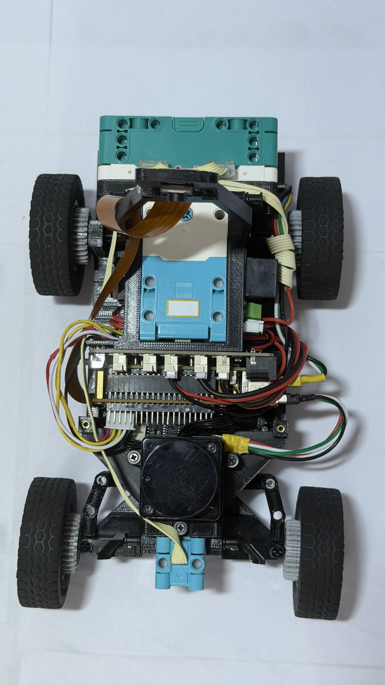
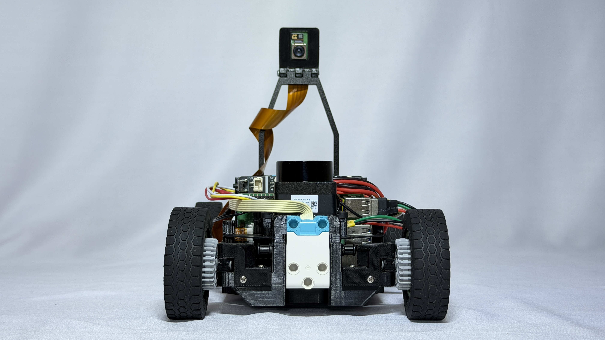
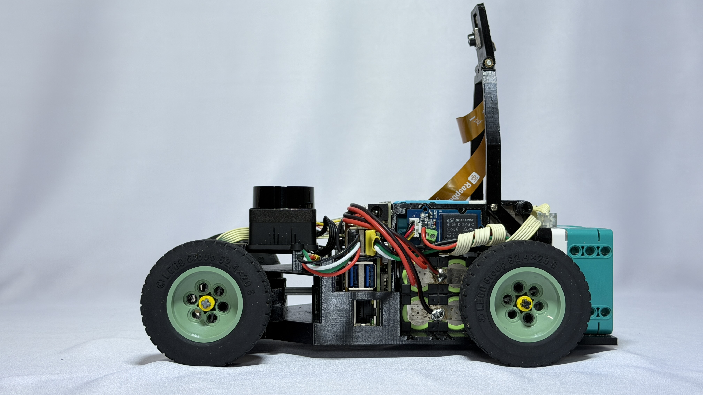
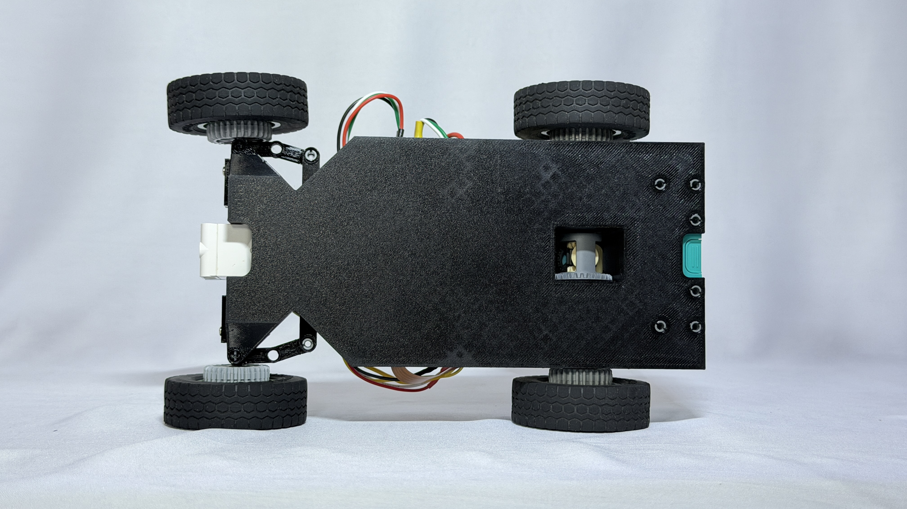
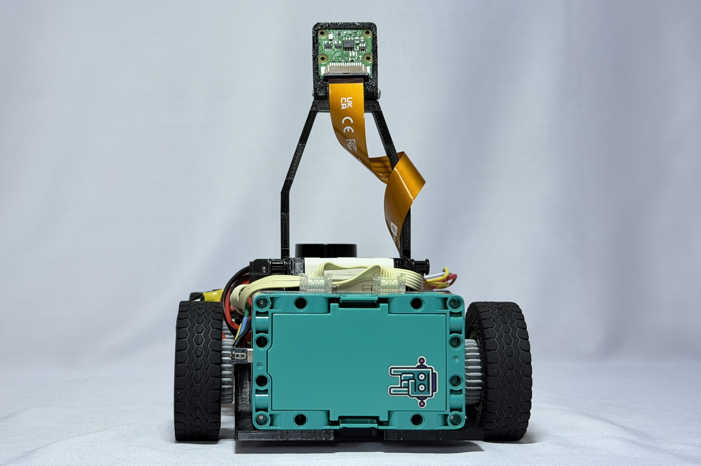
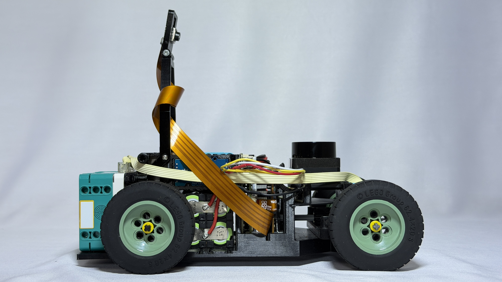

# CSS - WRO Future Engineers 2026

This repository contains the engineering documentation for **CSS**'s autonomous vehicle for the **WRO Future Engineers**, 2026 season. Our team is based in Querétaro, México.

> 📝 **TODO — reminder for the whole file:** the rules require the solution description to be at least 5,000 characters of actual written content (not counting placeholders/headers). Track this as you fill sections in — right now the file is mostly structure.

---

## Table of Contents

1. [Our Team](#our-team)
2. [Challenge Overview](#challenge-overview)
3. [Our Robot](#our-robot)
   - [3.1 Mobility Management](#mobility-management)
   - [3.2 Power & Sense Management](#power-sense-management)
   - [3.3 Obstacle Management & Control Strategy](#obstacle-management)
4. [Engineering Process & Design Iterations](#engineering-process)
5. [Construction Guide](#construction-guide)
6. [Cost Report](#cost-report)
7. [Repository Structure](#repository-structure)
8. [Setup & Execution Instructions](#setup-instructions)
9. [Driving Video](#driving-video)
10. [Resources & References](#resources)
11. [License](#license)

---

## 1. Our Team <a id="our-team"></a>
<mark>Add team picture</mark>

### Team Members

#### Christian Gael Centeno Velez
**Age:** 17\
**Role:** Captain. Software, electronics and mechanical design

> 📝 **TODO — Brief description:** 2–4 sentences. What's his robotics/WRO background? What specifically does he own on this build (which code modules, which mechanical subsystems)? Judges use this to understand real team composition, not just names.

> "[Optional quote — delete this line entirely if you don't want to include one]"

#### Sebastián Esquivel Mondragón
**Age:** 18\
**Role:** Documentation, electronics and mechanical design

Currently pursuing a Bachelor of Science in Mechatronics Engineering at ITESM.\
Previous experience in several WRO editions, both in Future Engineers and RoboMission.\
> 📝 **TODO — Continue brief description:** What carries over from past seasons into this build? What specifically do you own in documentation/electronics/mechanical design this year?

> "[Optional quote]"

---

### Coaches

#### Manuel Alejandro Cardoso Duarte
**Age:** <mark>Age</mark>\
**Role:** Coach

> 📝 **TODO — Brief description:** Background (engineering/teaching/prior WRO experience). Per rule 3.3, keep the framing consistent with "guides, doesn't build or code."

> "[Optional quote]"

#### José de Jesús Santana Ramírez
**Age:** <mark>Age</mark>\
**Role:** Coach

> 📝 **TODO — Brief description:** same guidance as above.

> "[Optional quote]"

---

## 2. Challenge Overview <a id="challenge-overview"></a>


The **WRO Future Engineers** challenge requires teams to build a fully autonomous vehicle capable of completing both of the following challenges:

### Open Challenge
The vehicle must complete three laps on the track with random placements of the inside track walls.

### Obstacle Challenge
The vehicle must complete three laps on the track while detecting and avoiding randomly placed coloured obstacles (either green or red blocks), passing them on a specific side according to their colour, and then finish by performing a parallel parking maneuver.

More info: [WRO Official Site](https://wro-association.org/) | [Future Engineers Rules](https://wro-association.org/wp-content/uploads/WRO-2026-Future-Engineers-Self-Driving-Cars-General-Rules.pdf)

---

## 3. Our Robot <a id="our-robot"></a>

**Robot name:** <mark>Name</mark>


<table style="width:100%">

<tr>

<td align="center"><br>Top</td>

<td align="center"><br>Front</td>

<td align="center"><br>Left</td>

</tr>

<tr>

<td align="center"><br>Bottom</td>

<td align="center"><br>Back</td>

<td align="center"><br>Right</td>

</tr>

</table>

<mark>Add fpv video</mark>
> 📝 Optional/supplementary only — this is separate from the *required* driving-demonstration videos in §9. Skip if you don't have footage.

> 📝 **TODO — Brief general description:** 3–5 sentences summarizing chassis type, drive layout, sensor suite, and what's distinctive about your approach. This is the "executive summary" before the detailed sections below.

### 3.1 Mobility Management <a id="mobility-management"></a>

#### Steering System
> 📝 **TODO (Criterion 1 — Mobility & Mechanical Design):** Geometry (Ackermann or otherwise), servo model, torque/speed, max turning angle. For a high score, explain *why*: what turning radius did the track geometry demand, and did you test/tune this against actual corner sections?

#### Drivetrain
> 📝 **TODO:** Motor(s), gear reduction ratio, wheels. Rule 11.13 caps you at 2 driving motors on a shared axle/gearing (no independent per-side motors) — make sure your description matches this, and explain your ratio choice (speed vs. torque tradeoff).

The vehicle uses a single LEGO SPIKE Large Motor (45602) driving the rear axle through a $20{:}28$ gear reduction ($R = 1.4$), turning LEGO $62.4 \times 20\text{S}$ rubber tires ($r = 0.0312\text{ m}$). The motor and gear ratio were not assumed — they were sized against a full dynamic torque analysis targeting $a = 0.73\text{ m/s}^2$ over $t = 0.5\text{ s}$ to reach cruising speed.

**Result:** at this operating point, the motor runs at only **33.8%** of its continuous max-efficiency torque capacity, reaching a loaded top speed of **0.365 m/s** — leaving a **66.2%** torque reserve for inclines or unexpected track perturbations.

<details>
<summary><b>Full torque & speed derivation</b></summary>

#### 1. Design Inputs & Parameters

| Parameter | Symbol | Value | Unit |
| :--- | :---: | :---: | :---: |
| Robot Mass | $m$ | $1.006$ | $\text{kg}$ |
| Wheel Diameter | $d$ | $0.0624$ | $\text{m}$ |
| Wheel Radius | $r$ | $0.0312$ | $\text{m}$ |
| Target Linear Acceleration ($t = 0.5\text{ s}$) | $a$ | $0.73$ | $\text{m/s}^2$ |
| Rolling Resistance Coeff. (Rubber LEGO $62.4 \times 20\text{ S}$) | $C_{rr}$ | $0.03$ | -- |
| Acceleration of Gravity | $g$ | $9.81$ | $\text{m/s}^2$ |
| Number of Drive Motors | $N$ | $1$ | -- |
| Gearbox Reduction Ratio ($20:28$) | $R$ | $1.4$ | -- |
| Gearbox Efficiency | $\eta$ | $0.85$ | -- |

#### 2. Step-by-Step Derivation

**Step 1: Linear Acceleration Force ($F_{acc}$)**
$$F_{acc} = m \cdot a = 1.006\text{ kg} \cdot 0.73\text{ m/s}^2 = 0.7344\text{ N}$$

**Step 2: Rolling Resistance Force ($F_{rr}$)**
$$F_{rr} = C_{rr} \cdot m \cdot g = 0.03 \cdot 1.006\text{ kg} \cdot 9.81\text{ m/s}^2 = 0.2961\text{ N}$$

**Step 3: Total Linear Force ($F_{total}$)**
$$F_{total} = F_{acc} + F_{rr} = 0.7344\text{ N} + 0.2961\text{ N} = 1.0305\text{ N}$$

**Step 4: Total Wheel Torque ($T_w$)**
$$T_w = F_{total} \cdot r = 1.0305\text{ N} \cdot 0.0312\text{ m} = 0.03215\text{ N}\cdot\text{m}$$

**Step 5: Nominal Motor Torque ($T_m$)**
$$T_m = \frac{T_w}{\eta \cdot R} = \frac{0.03215\text{ N}\cdot\text{m}}{0.85 \cdot 1.4} = 0.02702\text{ N}\cdot\text{m} \quad (\approx 2.70\text{ Ncm})$$

**Step 6: Motor Torque with Safety Factor ($T_{m,req}$)**

A $25\%$ safety margin ($1.25\times$) is applied to establish the minimum required torque of the traction motor, accounting for dynamic losses not captured above:
$$T_{m,req} = T_m \cdot 1.25 = 0.02702\text{ N}\cdot\text{m} \cdot 1.25 = \mathbf{0.03377\text{ N}\cdot\text{m}} \quad (\approx 3.38\text{ Ncm})$$

#### 3. LEGO SPIKE Large Motor (45602) Analysis & Speed Derivation

**3.1 Motor Technical Specifications (9V)**

| Operating Condition | Torque ($\text{N}\cdot\text{m}$) | Torque ($\text{Ncm}$) | Speed ($\text{RPM}$) | Current ($\text{mA}$) |
| :--- | :---: | :---: | :---: | :---: |
| No Load | $0.0000$ | $0.00$ | $175 \pm 15\%$ | $135 \pm 15\%$ |
| Max Efficiency | $0.0800$ | $8.00$ | $135 \pm 15\%$ | $430 \pm 15\%$ |
| Stall Limit | $0.2500$ | $25.00$ | $0$ | $1900 \pm 15\%$ |

**3.2 Motor Operating Point & Load Analysis**

* **Continuous Duty Load** (vs. Max Efficiency Point):
$$\text{Load}_{\%,\text{eff}} = \frac{T_m}{T_{\text{max\_eff}}} \cdot 100 = \frac{2.70\text{ Ncm}}{8.00\text{ Ncm}} \cdot 100 = \mathbf{33.8\%}$$

* **Stall Limit Margin** (vs. Stall Torque):
$$\text{Load}_{\%,\text{stall}} = \frac{T_m}{T_{\text{stall}}} \cdot 100 = \frac{2.70\text{ Ncm}}{25.00\text{ Ncm}} \cdot 100 = \mathbf{10.8\%}$$

**3.3 Top Speed Derivation**

**Step 1: Loaded Motor RPM**
$$\text{RPM}_{motor} = \text{RPM}_{\text{no\_load}} \cdot \left(1 - \frac{T_m}{T_{\text{stall}}}\right) = 175 \cdot \left(1 - \frac{2.702\text{ Ncm}}{25.00\text{ Ncm}}\right) = 156.1\text{ RPM}$$

**Step 2: Loaded Wheel RPM**
$$\text{RPM}_{wheel} = \frac{\text{RPM}_{motor}}{R} = \frac{156.1\text{ RPM}}{1.4} = 111.5\text{ RPM}$$

**Step 3: Top Loaded Linear Speed**
$$v_{loaded} = \frac{\text{RPM}_{wheel} \cdot \pi \cdot d}{60} = \frac{111.5 \cdot \pi \cdot 0.0624}{60} = \mathbf{0.365\text{ m/s}}$$

**3.4 Technical Conclusion**

With $a = 0.73\text{ m/s}^2$, the robot reaches its operational cruising speed of $0.365\text{ m/s}$ in exactly $0.5\text{ s}$. Operating at only $33.8\%$ of the motor's continuous max-efficiency capacity ensures minimal thermal build-up and low current draw, leaving a $66.2\%$ torque reserve to absorb unexpected track perturbations.

</details>


#### Chassis Design
> 📝 **TODO:** Material (3D printed / laser-cut / structural PCB / etc.) and why. If this changed across prototypes, put the *history* in §4 and just state the *final* choice here.

#### Assembly & Balance
> 📝 **TODO:** Center of gravity, weight distribution, mounting notes, and any balance issues found during testing + how you fixed them.

---

### 3.2 Power & Sense Management <a id="power-sense-management"></a>

#### Sensors & Perception Units
*Describe each sensor: what it measures, why you chose it, and how it's integrated into your system.*

* **RPLiDAR S2L:**
  * **Function:** 360° distance measurement, wall and obstacle detection.
  * **Key Specs:** 📝 TODO — actual range, scan frequency, angular resolution from the datasheet.
  * **Why Chosen:** 📝 TODO — why this LiDAR over alternatives (cost, resolution, ease of integration, prior experience)?
* **IMU:**
  * **Model:** 📝 TODO — e.g., BNO055, MPU6050, etc.
  * **Function:** Orientation and heading estimation, drift detection.
  * **Integration:** 📝 TODO — fusion method with LiDAR/other readings (complementary filter, Kalman, etc.)?
* **[Other Sensor / Camera / Encoders]:**
  > 📝 **TODO — flag:** your repo structure (§7) references a Hailo AI accelerator and vision/segmentation code (`src/cpp/`, `src/HailoModels/`), but no camera or vision sensor is documented anywhere in this README yet. If a camera feeds the Hailo pipeline, document it here — model, resolution, FOV — and explain what the Hailo models actually do (pillar classification? segmentation? something else?).

#### Processing Architecture & Microcontrollers
> 📝 **TODO (Criterion 2):** You're using a Raspberry Pi 5 + Hailo AI HAT per your repo structure, but that combination isn't explained anywhere in prose. Describe the split: what runs on the Pi's CPU vs. what's offloaded to the Hailo accelerator, and why (e.g., real-time inference requirements).

#### Power Architecture & Motor Driver
* **Power Supply:** 📝 TODO — battery type/voltage, regulators, protection circuitry.
* **Motor Driver:** 📝 TODO — model, specs.

> 📝 **TODO (for a top score):** include a rough power budget — estimated current draw for motors vs. electronics — and explain how it shaped your battery/regulator choice.

#### Hardware Schematics & PCB Design
* **PCB Design (if applicable):** 📝 TODO — tool used, layer count, layout notes. If there's no custom PCB, say so explicitly rather than leaving this blank.
* **Schematic Diagram:** 📝 TODO — link to [`schemes/`](./schemes/) or embed an image.

#### Wireless Communication & Telemetry
> 📝 **TODO:** If WiFi/Bluetooth is used for debugging/telemetry, note explicitly that it's confirmed OFF during competition rounds (rule 11.10 — no wireless allowed while the vehicle runs). Explain protocol + purpose (e.g., remote log streaming during development).

---

### 3.3 Obstacle Management & Control Strategy <a id="obstacle-management"></a>

#### System & Software Architecture
> 📝 **TODO (Criterion 3 — Software Architecture):** Include an actual data-flow diagram (sensors → processing → decision → actuators), not just prose. Confirm language (C++) and platform (Raspberry Pi 5) — consistent with what's below, keep it that way.

#### LiDAR & Perception Processing
> 📝 **TODO:** How are LiDAR scans filtered/interpreted? Wall detection, corner detection, minimum-distance thresholds, and how green/red blocks are identified (cross-reference §3.2 if this overlaps with the camera/Hailo pipeline).

#### Sensor Fusion & Heading Estimation
> 📝 **TODO:** Name the actual method combining IMU + LiDAR/vision for orientation/position (complementary filter, EKF, etc.) — "sensor fusion" alone isn't enough detail.

#### Trajectory Control & Closed-Loop Steering
> 📝 **TODO (Criterion 3, top-score territory):** Controller type (PID or other), inputs/outputs, actual gain values. For a 6, describe your tuning process — something you tried that didn't work, and what you changed to fix it.

#### Avoidance & Navigation Logic
* **Passing Rules:** Green → pass on left | Red → pass on right *(correct per rule 9.19 — no changes needed)*
* **Parallel Parking Maneuver:** 📝 TODO — how is the parking lot detected, and how is the maneuver executed?

#### State Machine & Safety Systems
* **Robot States:** Startup, normal navigation, obstacle avoidance, parking, stopped.
  > 📝 *(TODO: confirm this matches your actual implementation, or replace with your real state list.)*
* **Safety Systems:** 📝 TODO — emergency stop mechanism, sensor-failure handling, automatic recovery behavior.

---

## 4. Engineering Process & Design Iterations <a id="engineering-process"></a>

> 📝 **TODO — Engineering Journal Link:** add once available.

### Prototype Evolution
> 📝 **TODO (Criterion 4 — Systems Thinking, the highest-value section in the whole rubric):** don't just list what changed — explain the problem you were solving, what you tried, what failed and why, and what evidence (tests, data) supported the final choice. This is the "we chose X instead of Y because…" reasoning the rubric explicitly rewards at level 6.

* **Prototype 1:** 📝 TODO — initial design, what you tested, what failed.
* **Prototype 2 (Final):** 📝 TODO — specific improvements to chassis rigidity, weight balance, wiring, and *why* each was made.

### Key Challenges & Solutions
> 📝 **TODO:** pick 2–3 real technical problems and document problem → investigation → solution. (The RPLiDAR SDK scaling-factor question you were debugging — `dist_mm_q6` vs. `dist_mm_q2` — is a strong candidate if you've resolved it: it's exactly the kind of concrete, verifiable technical decision this section should showcase.)

* **Challenge:** 📝 TODO
* **Solution:** 📝 TODO

---

## 5. Construction Guide <a id="construction-guide"></a>

### General Steps
1. 3D design and CAD preparation
2. Part fabrication / 3D printing
3. Mechanical assembly & drivetrain mounting
4. Wiring and power electronics integration
5. Software environment installation
6. Sensor calibration & motor tuning
7. On-track testing

*(Generic sequence is fine to keep — just confirm it matches your actual build order before finalizing.)*

### Tools Used
* 📝 TODO — 3D printer model
* 📝 TODO — soldering tools
* 📝 TODO — other relevant tools

---

## 6. Cost Report <a id="cost-report"></a>

> 📝 **TODO:** not directly scored by the Appendix C rubric, but expected by the template and low-effort to complete — fill in real unit costs/quantities in MXN.

| Component | Qty | Unit Cost (MXN) | Total (MXN) |
|---|---|---|---|
| Raspberry Pi 5 | 1 | $\vert{}$ |
| RPLiDAR S2L | 1 | $\vert{}$ |
| IMU [model] | 1 | $\vert{}$ |
| [Microcontroller] | 1 | $\vert{}$ |
| [Motor] | 1 | $\vert{}$ |
| [Steering servo] | 1 | $\vert{}$ |
| [Battery] | 1 | $\vert{}$ |
| [Chassis/3D printing] | - | $\vert{}$ |
| **Total** | | | **$ ** |

---

## 7. Repository Structure <a id="repository-structure"></a>

*(Solid as written — matches your actual repo layout in enough detail to be genuinely useful. Leave as-is unless the structure itself changes.)*

```text
.
├── models/
│   └── cad/                    # CAD designs for chassis and brackets
│       ├── New/                # Current vehicle revision files
│       └── old/                # Prototype iteration CAD files
├── other/
│   ├── additionalPictures/     # Track diagrams and challenge visuals
│   └── software_26topsRaspHAT/ # Raspberry Pi Hailo HAT configs and tools
├── schemes/
│   └── hardware/               # Electrical documentation & hardware files
│       ├── bom/                # Bill of Materials and component specs
│       ├── bringup/            # Hardware testing and validation logs
│       └── pcb/                # PCB design, layouts, and schematics
├── src/                        # Main C++ autonomous driving software
│   ├── config/                 # System configuration and YAML parameters
│   ├── cpp/                    # Vision, segmentation, and perception logic
│   ├── HailoModels/             # Pre-compiled models for Hailo AI accelerator
│   ├── ondevice/               # Hardware SDKs (ORadar, RPLiDAR)
│   └── tools/                  # Utility scripts and test binaries
├── t-photos/                   # Team photos (members & coaches)
├── v-photos/                   # 6-view vehicle photos
│   └── Robot_More_Photos/      # High-resolution gallery & testing shots
├── video/                      # Demonstration videos and autonomous run clips
└── README.md                   # Main project documentation
```

## 8. Setup & Execution Instructions <a name="setup-instructions"></a>

> 📝 **TODO — highest-priority gap for Criterion 5 (Reproducibility).** Without this, no one — including judges — can verify your code runs. Write concrete step-by-step instructions: dependencies to install, how to build/compile, how to flash/run on the Raspberry Pi, and any calibration steps needed before first run.

## 9. Driving Video <a name="driving-video"></a>

> 📝 **TODO — hard requirement (Chapter 7 of the General Rules), not optional.** You need two YouTube links (public or accessible-by-link): one showing the vehicle autonomously completing the Open Challenge, one for the Obstacle Challenge. Each must show at least 30 continuous seconds of autonomous driving. Missing this directly reduces your documentation score.

---

## 10. Resources <a name="resources"></a>

- [WRO Official Site](https://wro-association.org/)
- [Future Engineers Rules](https://wro-association.org/wp-content/uploads/WRO-2026-Future-Engineers-Self-Driving-Cars-General-Rules.pdf)
- [Team Repository](https://github.com/alex309-duarte/WRO_Future_Engineers_Queretaro_CSS)

---

## 11. License <a name="license"></a>

```text
MIT License

Copyright (c) 2026 CSS (Christian Gael Centeno Velez, Sebastián Esquivel Mondragón)

Permission is hereby granted, free of charge, to any person obtaining a copy
of this software and associated documentation files (the "Software"), to deal
in the Software without restriction, including without limitation the rights
to use, copy, modify, merge, publish, distribute, sublicense, and/or sell
copies of the Software, and to permit persons to whom the Software is
furnished to do so, subject to the following conditions:

The above copyright notice and this permission notice shall be included in all
copies or substantial portions of the Software.

THE SOFTWARE IS PROVIDED "AS IS", WITHOUT WARRANTY OF ANY KIND, EXPRESS OR
IMPLIED, INCLUDING BUT NOT LIMITED TO THE WARRANTIES OF MERCHANTABILITY,
FITNESS FOR A PARTICULAR PURPOSE AND NONINFRINGEMENT. IN NO EVENT SHALL THE
AUTHORS OR COPYRIGHT HOLDERS BE LIABLE FOR ANY CLAIM, DAMAGES OR OTHER
LIABILITY, WHETHER IN AN ACTION OF CONTRACT, TORT OR OTHERWISE, ARISING FROM,
OUT OF OR IN CONNECTION WITH THE SOFTWARE OR THE USE OR OTHER DEALINGS IN THE
SOFTWARE.
```

---

> *Document maintained by CSS | Last updated: September 2026*