# Proceso de ensamblaje del robot

**WRO Future Engineers · Queretaro CSS**

50 fotografías seleccionadas, en orden cronológico de armado (según la fecha/hora EXIF de captura). Las fotos casi idénticas o sin relevancia adicional fueron omitidas.

---

## Paso 01 de 50 — Celda de batería individual

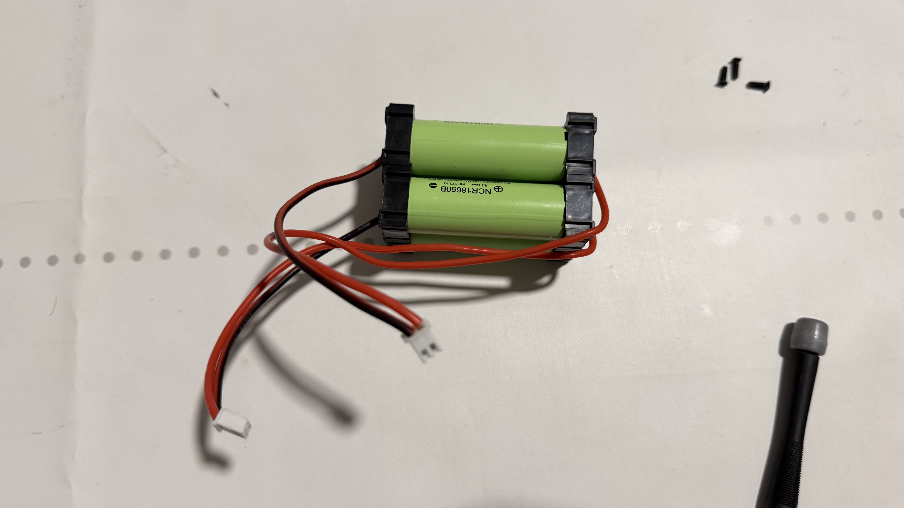

Una celda 18650 con sus cables positivo (rojo) y negativo (negro) ya soldados, pieza suelta antes de integrarse al paquete de baterías.

*Archivo original: `IMG_E6608.JPG`*

---

## Paso 02 de 50 — Motor de tracción con su driver

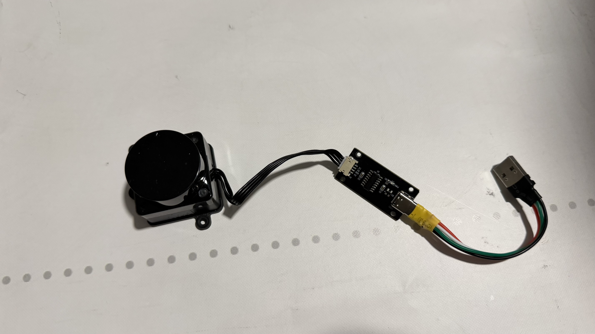

Motor DC de tracción conectado a su controlador/ESC mediante el conector de 3 pines, listo para integrarse al chasis.

*Archivo original: `IMG_E6610.JPG`*

---

## Paso 03 de 50 — Cableado interno del chasis

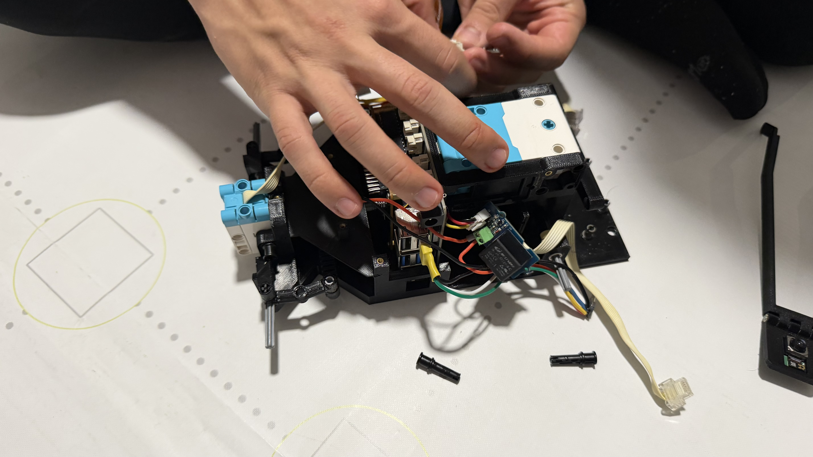

Ajustando manualmente el cableado y los conectores dentro de la estructura del chasis durante el armado inicial.

*Archivo original: `IMG_E6612.JPG`*

---

## Paso 04 de 50 — Raspberry Pi y HAT de IA

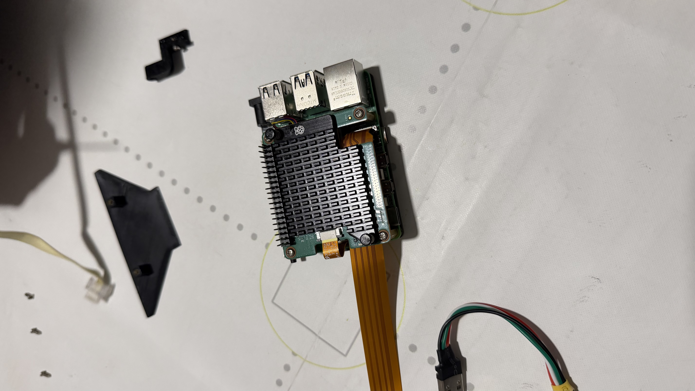

Raspberry Pi con el HAT de inteligencia artificial (Hailo) apilado y el cable flex de la cámara ya conectado, antes de montarse en el chasis.

*Archivo original: `IMG_E6613.JPG`*

---

## Paso 05 de 50 — Todas las piezas listas

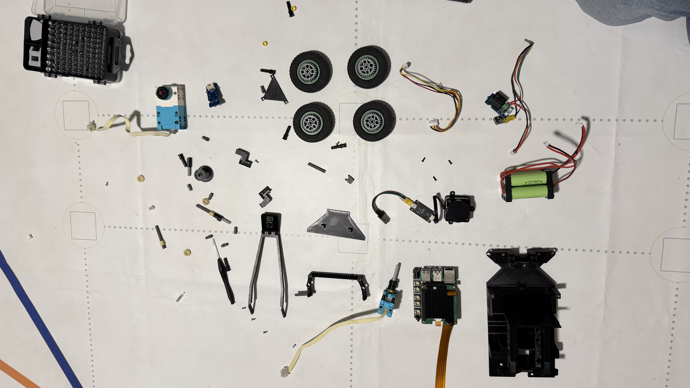

Vista general de todas las piezas del robot -- ruedas, engranes, soportes impresos en 3D, batería, motores y placas -- organizadas antes de iniciar el armado.

*Archivo original: `IMG_E6615.JPG`*

---

## Paso 06 de 50 — Chasis impreso en 3D

Base y soporte de dirección del chasis, recién impresos en 3D, todavía sin electrónica ni tren motriz.

*Archivo original: `IMG_E6620.JPG`*

---

## Paso 07 de 50 — Piezas del sistema de dirección

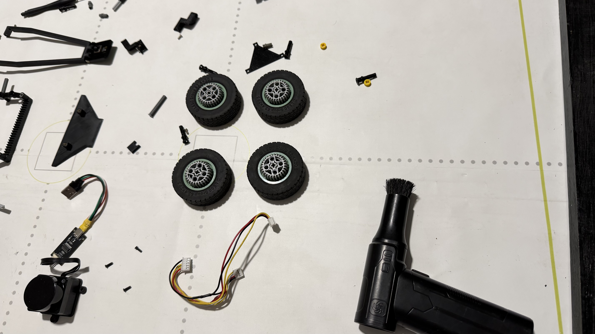

Ruedas, buje central y cableado del servo de dirección organizados antes de instalarse en el chasis.

*Archivo original: `IMG_E6622.JPG`*

---

## Paso 08 de 50 — Inicio del armado del chasis

Vista general del área de trabajo mientras se comienza a ensamblar la estructura del chasis.

*Archivo original: `IMG_E6623.JPG`*

---

## Paso 09 de 50 — Atornillando componentes internos

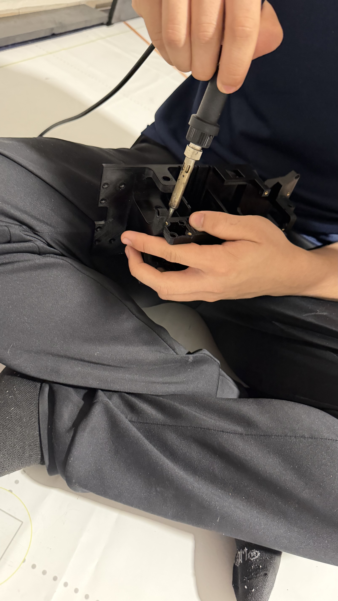

Primer plano fijando piezas dentro del chasis con un desarmador de precisión.

*Archivo original: `IMG_E6626.JPG`*

---

## Paso 10 de 50 — Ajuste final de la caja de engranes

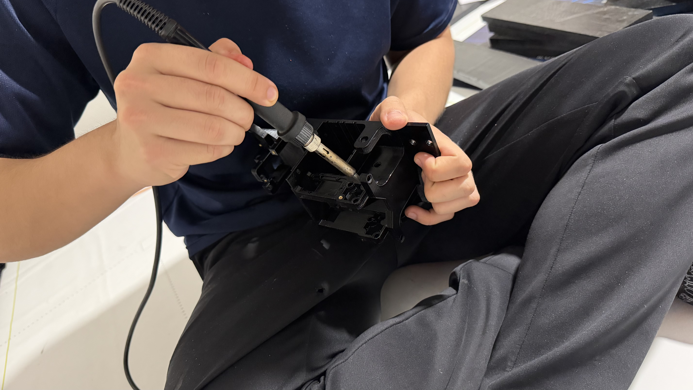

Apretando un tornillo final en la caja de engranajes recién ensamblada.

*Archivo original: `IMG_E6631.JPG`*

---

## Paso 11 de 50 — Caja de engranes vacía

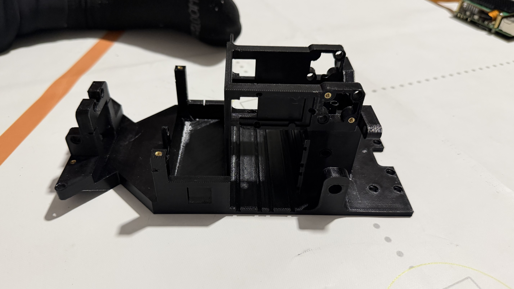

Caja de transmisión impresa en 3D vista desde arriba, todavía vacía, lista para recibir el motor y los engranes.

*Archivo original: `IMG_E6633.JPG`*

---

## Paso 12 de 50 — Ejes y engrane de tracción

Flechas metálicas y el engrane/polea de tracción, piezas sueltas antes de montarse dentro de la caja de engranes.

*Archivo original: `IMG_E6634.JPG`*

---

## Paso 13 de 50 — Primer engrane instalado

Caja de engranajes con el primer engrane y su eje ya instalados dentro del chasis.

*Archivo original: `IMG_E6636.JPG`*

---

## Paso 14 de 50 — Fijando la tapa de la caja de engranes

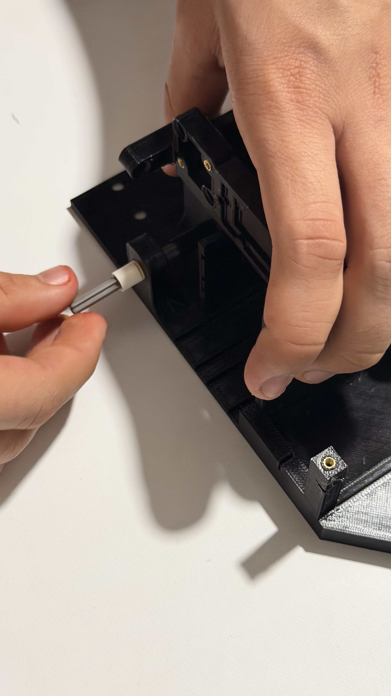

Atornillando la pieza lateral que cierra la caja de engranes con un desarmador pequeño.

*Archivo original: `IMG_E6638.JPG`*

---

## Paso 15 de 50 — Eje central de transmisión

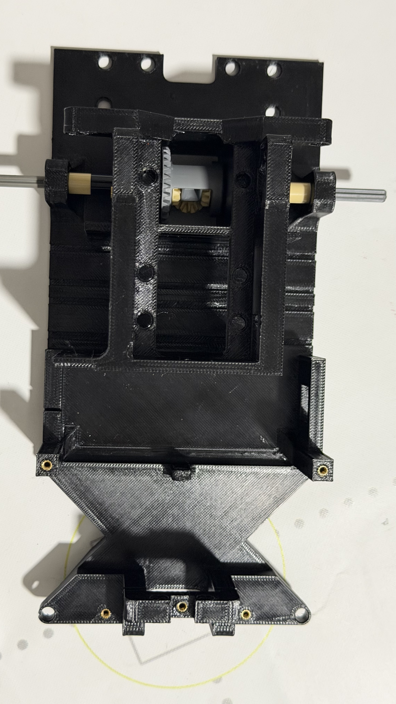

Vista superior del chasis con el eje central de la transmisión ya instalado y pasante.

*Archivo original: `IMG_E6640.JPG`*

---

## Paso 16 de 50 — Instalando el servo de dirección

El servomotor de dirección (azul) siendo colocado en la parte frontal del chasis.

*Archivo original: `IMG_E6642.JPG`*

---

## Paso 17 de 50 — Servo de dirección en su soporte

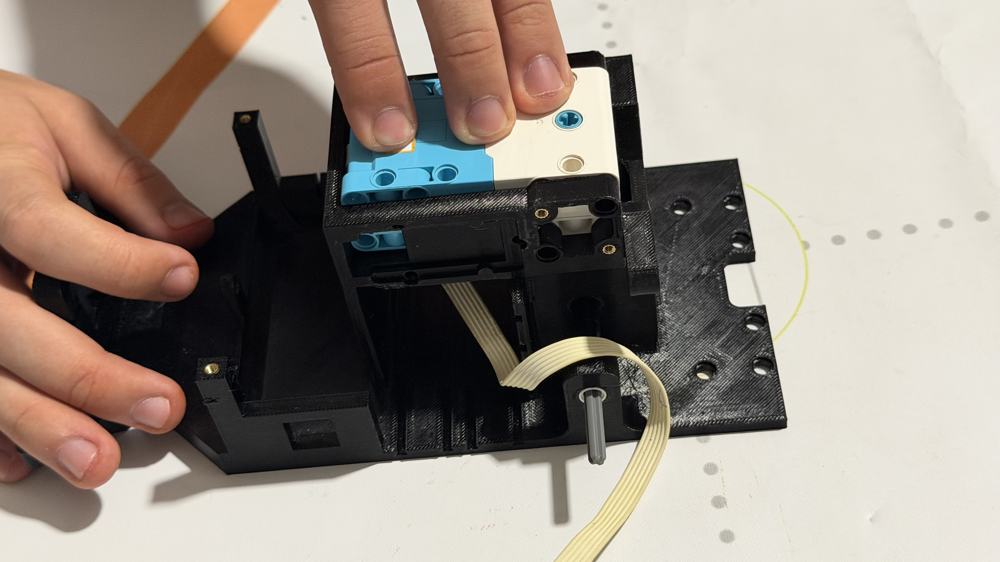

Ajustando el servo de dirección dentro de su soporte impreso en el chasis.

*Archivo original: `IMG_E6645.JPG`*

---

## Paso 18 de 50 — Placa de cómputo lista

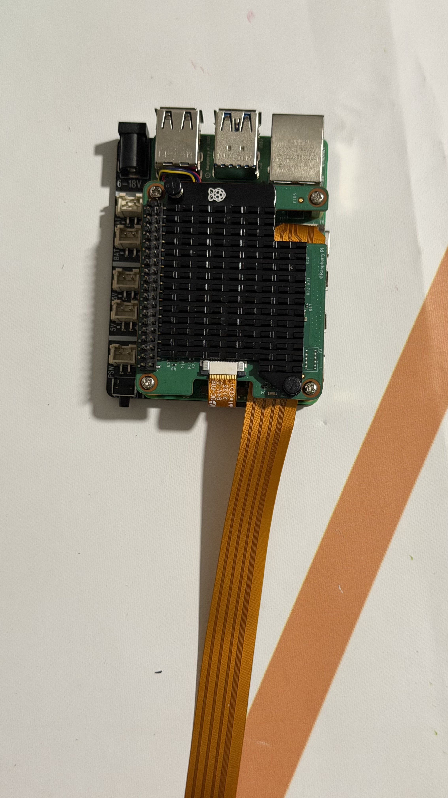

Raspberry Pi con el HAT de Hailo y el cable flex de la cámara ya integrados, lista para montarse sobre el chasis.

*Archivo original: `IMG_E6647.JPG`*

---

## Paso 19 de 50 — Dirección montada, chasis avanza

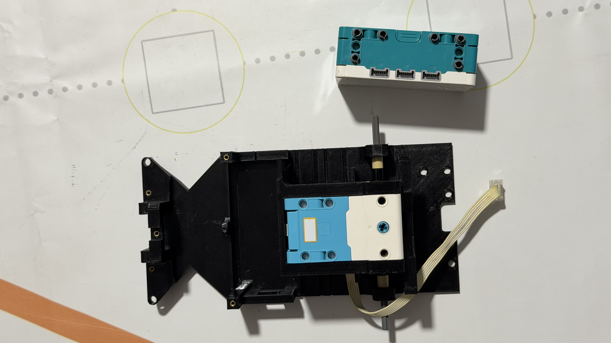

Chasis con el servo de dirección ya fijo y el cable flex de la cámara pasado a través de la estructura.

*Archivo original: `IMG_E6649.JPG`*

---

## Paso 20 de 50 — Vista lateral con dirección instalada

Costado del chasis mostrando el servo de dirección y su cableado ya integrados.

*Archivo original: `IMG_E6652.JPG`*

---

## Paso 21 de 50 — Cerebro del robot integrado

La Raspberry Pi con el HAT de IA apilada sobre el chasis, con los cables flex ya conectados: el sistema de cómputo integrado a la estructura.

*Archivo original: `IMG_E6655.JPG`*

---

## Paso 22 de 50 — Fijando la placa de cómputo

Ajustando y centrando la placa Raspberry Pi/HAT sobre el chasis para atornillarla.

*Archivo original: `IMG_E6658.JPG`*

---

## Paso 23 de 50 — Conectando el cable de la cámara

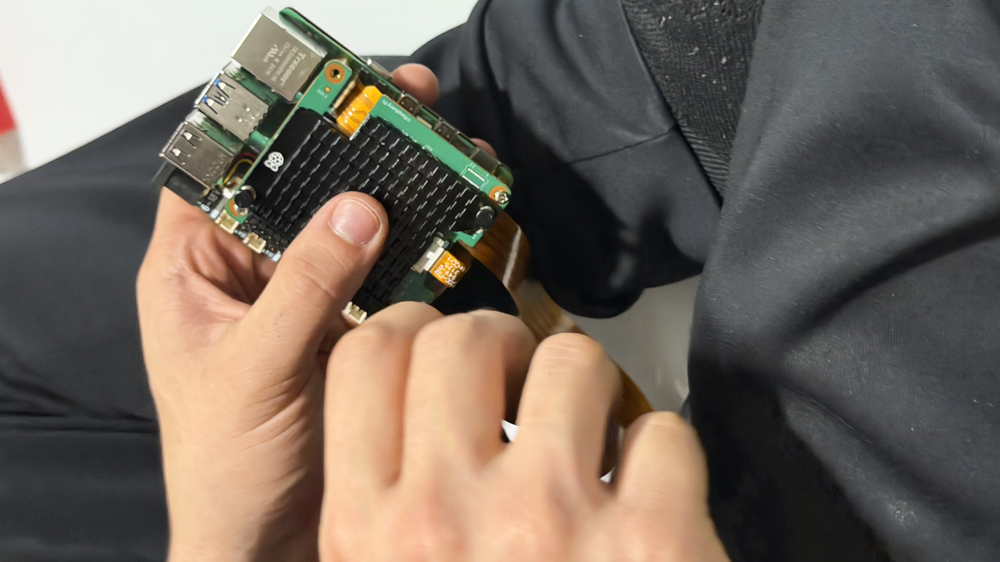

Conectando el cable flex de la cámara directamente al conector CSI de la Raspberry Pi.

*Archivo original: `IMG_E6660.JPG`*

---

## Paso 24 de 50 — Placa de cómputo centrada

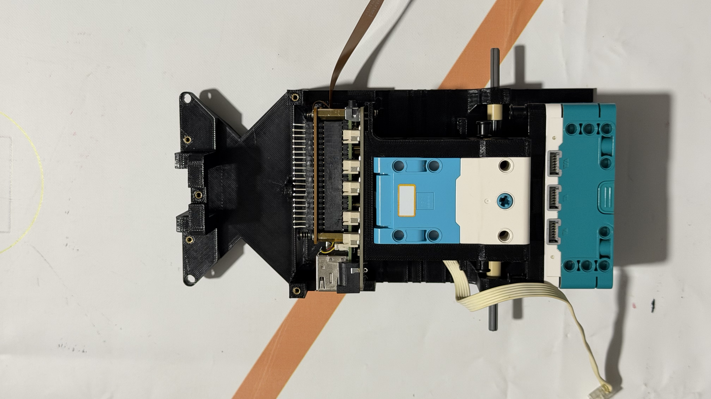

Vista superior del chasis con la placa de cómputo ya centrada y atornillada en su posición final.

*Archivo original: `IMG_E6663.JPG`*

---

## Paso 25 de 50 — Módulos Grove listos

Módulo Grove de botón con LED y módulo de relevador, con su cableado, listos para instalarse en el chasis.

*Archivo original: `IMG_E6664.JPG`*

---

## Paso 26 de 50 — Tren motriz por debajo

Vista inferior del chasis mostrando el motor de tracción, los engranes y el cableado ya integrados.

*Archivo original: `IMG_E6666.JPG`*

---

## Paso 27 de 50 — Conexionado de motores

Conectando los cables del motor y del servo a los conectores del driver dentro del chasis.

*Archivo original: `IMG_E6669.JPG`*

---

## Paso 28 de 50 — Batería instalada

Chasis de pie con el paquete de baterías 18650 ya montado en la parte trasera.

*Archivo original: `IMG_E6675.JPG`*

---

## Paso 29 de 50 — Cableado principal acomodado

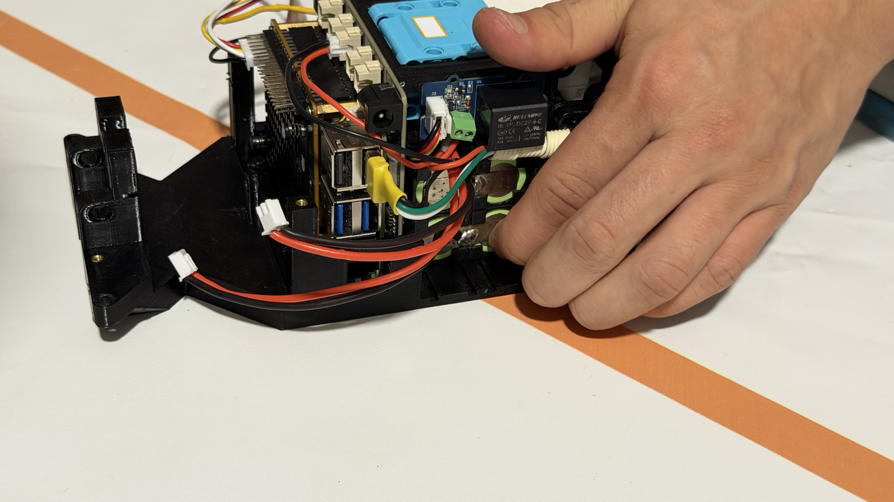

Vista lateral del chasis con la batería y el cableado principal ya acomodados dentro de la estructura.

*Archivo original: `IMG_E6677.JPG`*

---

## Paso 30 de 50 — Vista trasera del chasis

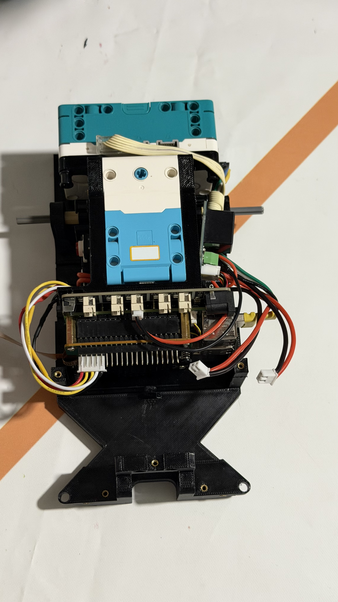

Parte posterior del chasis mostrando la batería y las conexiones traseras ya ordenadas.

*Archivo original: `IMG_E6680.JPG`*

---

## Paso 31 de 50 — Piezas del soporte trasero

Brazo de dirección trasero y tornillería sueltos, antes de montarse en el eje posterior.

*Archivo original: `IMG_E6681.JPG`*

---

## Paso 32 de 50 — Instalando el brazo trasero

Montando el brazo/soporte trasero sobre el eje de dirección del chasis.

*Archivo original: `IMG_E6683.JPG`*

---

## Paso 33 de 50 — Eje trasero ensamblado

Eje trasero con el brazo de dirección y los conectores azules ya montados, visto desde atrás.

*Archivo original: `IMG_E6684.JPG`*

---

## Paso 34 de 50 — Soportes en L y tornillería

Piezas de sujeción en forma de L, impresas en 3D, junto con sus tornillos, antes de integrarse al chasis.

*Archivo original: `IMG_E6686.JPG`*

---

## Paso 35 de 50 — Eje delantero listo para ruedas

Eje delantero con el brazo de dirección ya instalado, listo para recibir las ruedas.

*Archivo original: `IMG_E6688.JPG`*

---

## Paso 36 de 50 — Atornillando el soporte de dirección

Fijando el soporte de dirección con un desarmador pequeño.

*Archivo original: `IMG_E6690.JPG`*

---

## Paso 37 de 50 — Soporte de cámara y motor

Soporte triangular de la cámara junto con un motor y su cableado, piezas sueltas antes de montarse.

*Archivo original: `IMG_E6696.JPG`*

---

## Paso 38 de 50 — Instalando el módulo lidar

Montando el módulo cilíndrico del lidar en la parte superior del chasis.

*Archivo original: `IMG_E6698.JPG`*

---

## Paso 39 de 50 — Lidar integrado

Chasis con el módulo del lidar ya integrado en la parte superior de la estructura.

*Archivo original: `IMG_E6700.JPG`*

---

## Paso 40 de 50 — Ajustando el módulo superior

Manos ajustando y fijando el módulo recién instalado en la parte alta del chasis.

*Archivo original: `IMG_E6702.JPG`*

---

## Paso 41 de 50 — Electrónica superior integrada

Vista lateral del chasis con el lidar, la cámara y la placa de cómputo ya integrados juntos.

*Archivo original: `IMG_E6704.JPG`*

---

## Paso 42 de 50 — Chasis casi completo

El chasis de pie, mostrando toda la electrónica principal ya integrada verticalmente.

*Archivo original: `IMG_E6706.JPG`*

---

## Paso 43 de 50 — Ensamble completo sin ruedas

Vista superior del chasis totalmente ensamblado, todavía sin las ruedas instaladas.

*Archivo original: `IMG_E6708.JPG`*

---

## Paso 44 de 50 — Último ajuste de cableado

Ajustando un cable final con pinzas antes de proceder a instalar las ruedas.

*Archivo original: `IMG_E6711.JPG`*

---

## Paso 45 de 50 — Cableado completo a la vista

Chasis recostado de lado, mostrando el cableado completo recorriendo toda la estructura.

*Archivo original: `IMG_E6712.JPG`*

---

## Paso 46 de 50 — Ruedas listas para montar

Las cuatro llantas junto con sus separadores dorados, listas para instalarse en los ejes.

*Archivo original: `IMG_E6714.JPG`*

---

## Paso 47 de 50 — Primeras ruedas instaladas

Las dos primeras ruedas traseras ya instaladas en el chasis.

*Archivo original: `IMG_E6715.JPG`*

---

## Paso 48 de 50 — Instalando rueda delantera

Montando una de las ruedas delanteras en el eje de dirección.

*Archivo original: `IMG_E6717.JPG`*

---

## Paso 49 de 50 — Las cuatro ruedas instaladas

Chasis con las cuatro ruedas ya montadas: el robot puede rodar por primera vez.

*Archivo original: `IMG_E6719.JPG`*

---

## Paso 50 de 50 — Robot terminado

Revisión final del cableado con el robot completamente armado y apoyado sobre sus cuatro ruedas.

*Archivo original: `IMG_E6721.JPG`*

---
