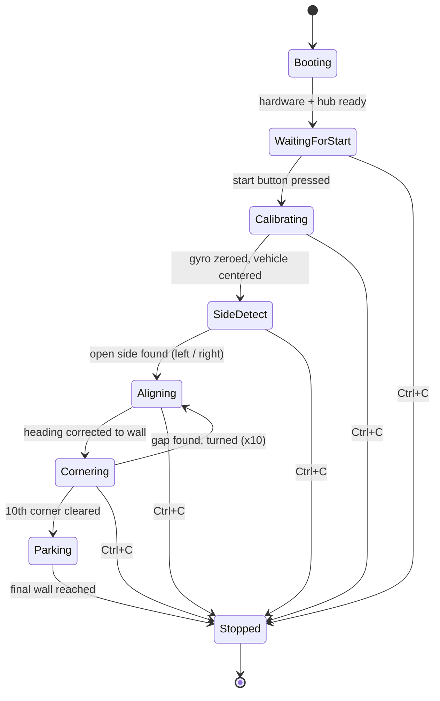

# Introduction

## The team
>Team members
- Sebastian Esquivel
- Santiago Mansilla
- Christian Centeno

## Open Challenge program flow

Traces `main()` top to bottom. The robot's own left/right turns are true
mirror images of each other in the code -- drawn once here as `sentido`
(the detected open side), with the mirror called out in the caption below.

```mermaid
flowchart TD
    A(["Power on"]) --> B["Init lidar + writer thread<br/>Init GPIO, power on SPIKE hub<br/>SPIKE serial + interpreter,<br/>load on-hub motion routines"]
    B --> C{{"Wait for start button"}}
    C --> D["Reset gyro to 0&deg;<br/>Center vehicle"]
    D --> E["Read lidar once:<br/>front / right / left distance"]
    E --> F{"right or left<br/>&gt; 800&nbsp;mm?"}
    F -- yes: OUTSIDE start --> G["First straight = 1350&nbsp;mm"]
    F -- no: INSIDE start --> H["First straight = 300&nbsp;mm"]
    G --> I["Detect which side is open:<br/>Advance_And_Detect_Side()<br/>&rarr; sentido = right | left"]
    H --> I
    I --> J["Turn 80&deg; toward sentido<br/>Center vehicle"]
    J --> K["Drive the first-straight distance,<br/>curving toward sentido"]
    K --> L["Slope() at +300&nbsp;mm,<br/>Slope() again at +700&nbsp;mm more"]
    L --> M["Average the two slopes<br/>Reset gyro to that heading"]
    M --> N(["Corner loop<br/>v = 0 &hellip; 9"])
    N --> O["Advance until a gap opens<br/>on the sentido side"]
    O --> P["Turn 80&deg; toward sentido<br/>Center vehicle"]
    P --> Q["Drive 300&nbsp;mm, then 700&nbsp;mm more,<br/>measuring + averaging slope again"]
    Q --> R["Reset gyro to the new heading"]
    R --> S{"v = 10?"}
    S -- "no (v&plus;&plus;)" --> N
    S -- yes --> T["Pick a stop distance from the<br/>opposite-side reading taken back<br/>at the start (400 / 600&nbsp;mm bands)"]
    T --> U["Turn 80&deg; toward sentido, center<br/>Drive 300&nbsp;mm"]
    U --> V{"front reading<br/>&gt; 1500&nbsp;mm?"}
    V -- yes --> W1["Advance to 1750&nbsp;mm from wall"]
    V -- no --> W2["Advance to 1400&nbsp;mm from wall"]
    W1 --> X["Coast motors &middot; close serial<br/>stop lidar thread &middot; close lidar"]
    W2 --> X
    X --> Z(["Run finished"])
```

> Every turn, distance, and threshold above is read directly out of
> `main.cpp`. **Sentido** (the detected open side) is fixed for the whole
> run right after the first turn -- the code for `sentido = left` is the
> exact sign-mirrored twin of the `right` path drawn here.

## High-level states

The same run, one level up -- the states a judge or teammate would
actually watch the robot move through.

> Ctrl+C sets the lidar's `terminating` flag from every state; the current
> busy-wait loop notices it within ~1 ms and the run drops straight to
> **Stopped** instead of finishing the maneuver in progress.

## Thresholds referenced above

Pulled straight from the constants in `main.cpp`, for whoever tunes this next.

| Constant | Value | Where it acts |
|---|---|---|
| Outside / inside split | `800 mm` | Right or left reading above this at the very start -> treated as an "outside" starting box, else "inside". |
| First straight, outside case | `1350 mm` | Distance driven right after the first turn, before the first slope measurement. |
| First straight, inside case | `300 mm` | Same step, shorter start -- inside boxes give less room before the first wall. |
| Slope sampling gap | `300 + 700 mm` | Two `Slope()` reads this far apart get averaged into one heading correction. |
| Corners per run | `10 (v < 10)` | Loop count for the corner-navigation phase -- matches the Open Challenge's three laps of the four-cornered field. |
| Corner turn angle | `80 deg` | Every `Spike_Turn_For_Degrees` call at a corner, in both the lap loop and the setup turn. |
| Final approach bands | `400 / 600 mm` | The opposite-side reading from step 1 selects a 550, 750, or 1050 mm stop distance for parking. |
| Final front threshold | `1500 mm` | Chooses whether the closing approach stops at 1400 or 1750 mm from the front wall. |

